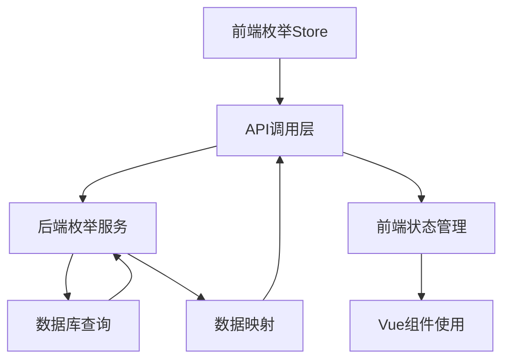
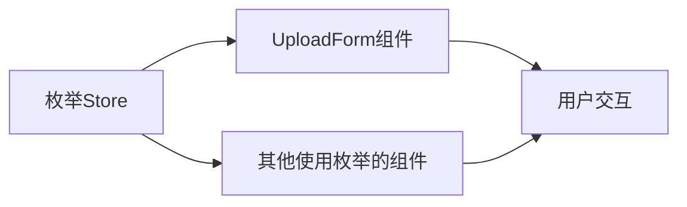
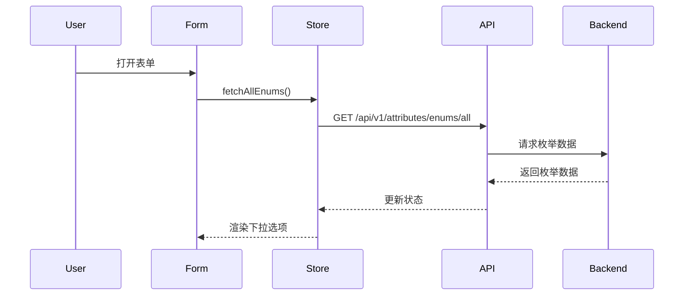

# 枚举API修复设计方案

## 整体架构

### 系统架构图


## 修复方案设计

### 1. API路径修正
- **问题**：路径重复 `/api/v1/api/v1/`
- **解决**：修正为正确的API路径 `/api/v1/attributes/enums/all`

### 2. 字段映射修正
- **前端字段映射表**：
  | 前端字段名 | 后端字段名 | 说明 |
  |------------|------------|------|
  | categories | clothingTypes | 衣物分类 |
  | styles | styles | 风格枚举 |
  | seasons | seasons | 季节枚举 |
  | occasions | occasions | 场合枚举 |
  | materials | materials | 材质枚举 |
  | colors | colors | 颜色枚举 |

### 3. 接口契约定义

#### 请求规范
```
GET /api/v1/attributes/enums/all
Headers: {
  Authorization: Bearer <token>
}
```

#### 响应规范
```javascript
{
  success: true,
  data: {
    clothingTypes: [EnumValue],
    styles: [EnumValue],
    seasons: [EnumValue],
    occasions: [EnumValue],
    materials: [EnumValue],
    colors: [EnumValue]
  }
}

// EnumValue结构
{
  value: string|number,
  label: string,
  color?: string // 仅颜色枚举
}
```

## 模块依赖关系

### 前端模块


### 数据流向


## 异常处理策略

### 网络异常
- 显示友好的错误提示
- 提供重试机制
- 记录错误日志

### 数据异常
- 空数据时显示占位符
- 数据格式错误时回退处理
- 提供默认值

### 兼容性处理
- 保持向后兼容
- 优雅降级
- 渐进式增强