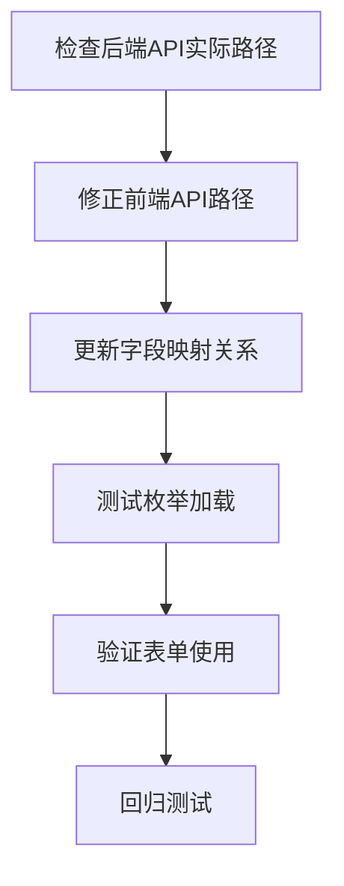

# 枚举API修复任务拆分

## 子任务依赖图

## 原子任务清单

### 任务1: 验证后端API实际路径
**输入契约**:
- 后端服务已启动 (localhost:3000)
- 已确认枚举API存在

**输出契约**:
- 确认正确的API路径
- 确认返回数据结构

**实现约束**:
- 使用curl或浏览器直接访问
- 记录实际返回格式

**依赖关系**:
- 无前置依赖
- 后续任务依赖此结果

---

### 任务2: 修正前端枚举Store的API路径
**输入契约**:
- 任务1确认的API路径
- 前端枚举Store文件路径

**输出契约**:
- 修正后的API调用路径
- 保持现有错误处理机制

**实现约束**:
- 仅修改路径，不改动其他逻辑
- 保持向后兼容

**依赖关系**:
- 依赖任务1的结果
- 阻塞任务3执行

---

### 任务3: 更新字段映射关系
**输入契约**:
- 任务1确认的数据结构
- 前端枚举Store代码

**输出契约**:
- 正确的字段映射
- 材质和颜色枚举正确加载

**实现约束**:
- 映射表清晰定义
- 提供默认值处理

**依赖关系**:
- 依赖任务2完成
- 阻塞任务4执行

---

### 任务4: 测试枚举数据加载
**输入契约**:
- 修正后的枚举Store
- 前端开发环境

**输出契约**:
- 枚举数据成功加载
- 控制台无错误

**实现约束**:
- 使用浏览器开发者工具
- 验证网络请求成功

**依赖关系**:
- 依赖任务3完成
- 阻塞任务5执行

---

### 任务5: 验证表单使用枚举
**输入契约**:
- 功能正常的枚举Store
- UploadForm组件

**输出契约**:
- 下拉框正确显示枚举值
- 表单提交功能正常

**实现约束**:
- 手动测试验证
- 截图记录结果

**依赖关系**:
- 依赖任务4完成
- 阻塞任务6执行

---

### 任务6: 回归测试
**输入契约**:
- 所有枚举功能
- 现有功能不受影响

**输出契约**:
- 确认无回归问题
- 更新测试文档

**实现约束**:
- 全面测试相关功能
- 记录测试结果

**依赖关系**:
- 依赖任务5完成
- 最终验收任务

## 任务执行顺序

1. **优先级1**: 任务1 - 确认后端API
2. **优先级2**: 任务2 - 修正API路径
3. **优先级3**: 任务3 - 更新字段映射
4. **优先级4**: 任务4 - 测试数据加载
5. **优先级5**: 任务5 - 验证表单使用
6. **优先级6**: 任务6 - 回归测试