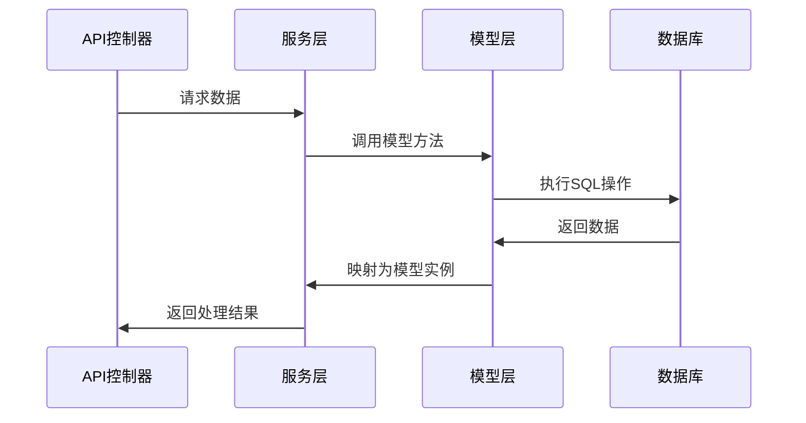

# 模型更新任务设计文档

## 整体架构图
```mermaid
dgraph TD
    subgraph 数据库层
        DB[MySQL数据库]
        T1[users表]
        T2[clothing表]
        T3[outfits表]
        T4[outfit_clothing表]
        T5[attributes表]
        T6[recommendations表]
        T7[user_behaviors表]
        T8[user_preferences表]
        T9[weather_data表]
    end
    
    subgraph 模型层
        M1[User模型]
        M2[Clothing模型]
        M3[Outfit模型]
        M4[OutfitClothing模型]
        M5[Attribute模型]
        M6[Recommendations模型]
        M7[UserBehavior模型]
        M8[UserPreferences模型]
        M9[WeatherData模型]
    end
    
    M1 -->|映射| T1
    M2 -->|映射| T2
    M3 -->|映射| T3
    M4 -->|映射| T4
    M5 -->|映射| T5
    M6 -->|映射| T6
    M7 -->|映射| T7
    M8 -->|映射| T8
    M9 -->|映射| T9
    
    M2 }o--o{ M5
    M3 }o--o{ M5
```

## 分层设计
1. **BaseModel层**：提供基础模型功能
2. **实体模型层**：映射到数据库表的具体模型
3. **关联层**：定义模型间的关系

## 核心组件
- **BaseModel.ts**：所有模型的基类，提供通用功能
- **实体模型文件**：每个数据库表对应一个模型文件
- **索引定义**：优化查询性能
- **关联关系**：定义表之间的外键关系

## 模块依赖关系
- 实体模型依赖BaseModel
- 部分实体模型相互依赖（如Clothing依赖Attribute）

## 接口契约定义
- 模型接口需严格匹配数据库表结构
- 字段名称、数据类型、可空性、默认值等需完全一致

## 数据流向图


## 异常处理策略
- 保持现有错误处理方式
- 确保数据库约束在模型层得到体现
- 添加适当的验证规则