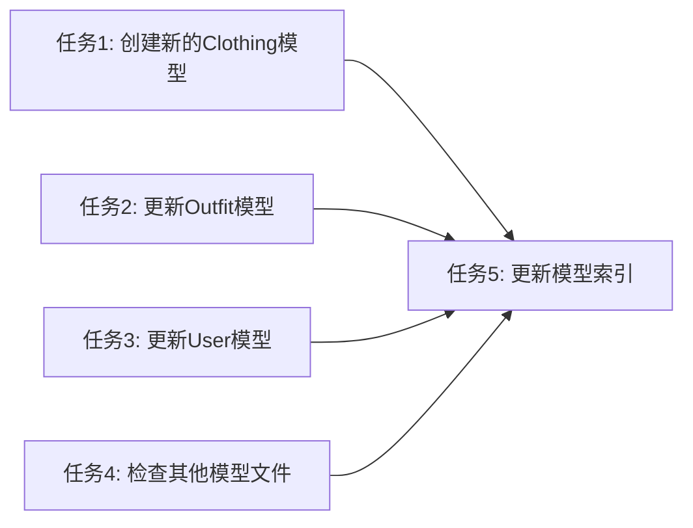

# 模型更新任务拆分文档

## 任务拆分

### 任务1: 创建新的Clothing模型
**输入契约**：
- 数据库表结构完整总结.md中的clothing表定义
- 现有的ClothingItem.ts模型文件

**输出契约**：
- 创建backend/src/models/entities/Clothing.ts文件
- 正确映射到clothing表
- 包含所有字段、索引和关联关系

**实现约束**：
- 遵循现有的代码风格
- 使用正确的数据类型和装饰器
- 定义与attributes表的关联

### 任务2: 更新Outfit模型
**输入契约**：
- 数据库表结构完整总结.md中的outfits表定义
- 现有的Outfit.ts模型文件

**输出契约**：
- 更新Outfit.ts文件以匹配数据库结构
- 修正字段类型（如season、occasion、style等改为int类型）
- 更新索引定义

### 任务3: 更新User模型
**输入契约**：
- 数据库表结构完整总结.md中的users表定义
- 现有的User.ts模型文件

**输出契约**：
- 更新User.ts文件以匹配数据库结构
- 确保所有字段、索引和关联关系正确

### 任务4: 检查其他模型文件
**输入契约**：
- 数据库表结构完整总结.md中其他表的定义
- 现有的其他模型文件

**输出契约**：
- 验证并更新其他模型文件
- 确保outfit_clothing、recommendations、user_behaviors、user_preferences、weather_data等模型与数据库一致

### 任务5: 更新模型索引
**输入契约**：
- 数据库表结构完整总结.md中的索引定义

**输出契约**：
- 在所有模型中更新索引定义
- 确保索引名称和字段与数据库一致

## 任务依赖图

## 执行检查清单
- ✅ 所有模型文件与数据库表结构一致
- ✅ 字段名称、数据类型、可空性正确
- ✅ 索引定义完整
- ✅ 关联关系正确建立
- ✅ 代码风格与现有代码一致