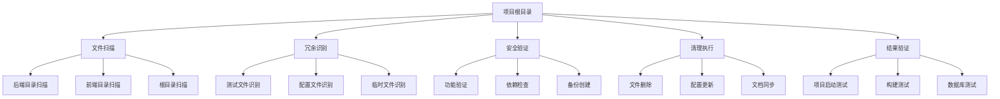
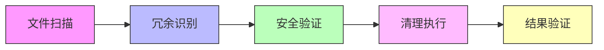

# 清理冗余文件架构设计

## 整体架构

## 分层设计

### 1. 文件识别层
- **扫描引擎**: 遍历项目目录
- **规则引擎**: 基于文件命名和用途识别冗余
- **分类系统**: 按类型分组待清理文件

### 2. 安全验证层
- **功能验证**: 确保删除不影响核心功能
- **依赖检查**: 验证无活跃依赖
- **备份机制**: 创建清理记录

### 3. 执行清理层
- **原子操作**: 按任务清单逐步清理
- **回滚机制**: 保留恢复能力
- **状态跟踪**: 记录清理进度

## 模块依赖关系

## 接口契约

### 输入契约
- 项目根目录路径
- 清理规则配置
- 备份策略配置

### 输出契约
- 清理清单
- 项目状态报告
- 更新后的文档

## 异常处理策略
- **文件不存在**: 跳过并记录
- **权限问题**: 提示用户手动处理
- **依赖冲突**: 中断并询问确认