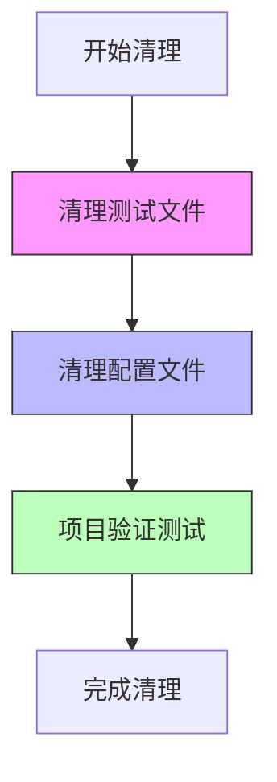

# 清理冗余文件任务分解

## 子任务清单

### 任务1: 冗余测试文件清理
**任务ID**: CLEAN-001
**输入契约**: 项目目录结构
**输出契约**: 清理后的测试文件列表
**实现约束**: 保留Git历史记录
**依赖关系**: 无前置依赖

#### 待清理文件
- [ ] `backend/test-connection.js` - 临时数据库测试
- [ ] `backend/test-mysql.js` - 详细MySQL测试
- [ ] `backend/simple-db-test.js` - 简化版测试

#### 验证标准
- [ ] 文件删除后项目正常启动
- [ ] 数据库连接功能正常
- [ ] 无功能缺失

### 任务2: 冗余配置文件清理
**任务ID**: CLEAN-002
**输入契约**: 项目配置文件列表
**输出契约**: 更新后的配置结构
**实现约束**: 保留生产配置
**依赖关系**: CLEAN-001完成后执行

#### 待清理文件
- [ ] `front/package-test.json` - 测试用package.json
- [ ] 检查并清理重复的配置项

#### 验证标准
- [ ] 构建流程正常
- [ ] 依赖管理正常
- [ ] 无配置冲突

### 任务3: 项目验证测试
**任务ID**: CLEAN-003
**输入契约**: 清理后的项目结构
**输出契约**: 验证报告
**实现约束**: 全面功能测试
**依赖关系**: CLEAN-001, CLEAN-002完成后执行

#### 测试内容
- [ ] 后端服务启动测试
- [ ] 前端构建测试
- [ ] 数据库连接测试
- [ ] 项目整体功能测试

## 任务依赖图

## 执行顺序
1. **CLEAN-001**: 清理测试文件
2. **CLEAN-002**: 清理配置文件
3. **CLEAN-003**: 项目验证测试

## 风险点
- **文件依赖**: 确保无活跃依赖
- **配置冲突**: 检查配置引用关系
- **版本控制**: 保留Git提交历史