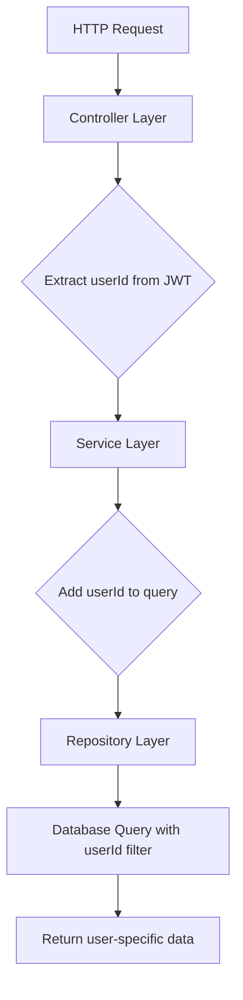

# 衣物查询权限修复设计文档

## 问题根因分析

**Controller层正确传递了userId，但Service层未使用**

- ✅ Controller: `getClothingItems` 正确从token获取userId并传递给service
- ❌ Service: `getClothingItems` 方法接收options参数，但Repository层需要userId
- ❌ Service: `getClothingItems` 方法没有将userId传递给Repository

## 修复方案

### 架构图



### 修复点

#### 1. Service层修复
**文件**: `backend/src/services/clothingService.ts`
**方法**: `getClothingItems`
**修改**: 将userId添加到查询选项

#### 2. 接口定义更新
**文件**: `backend/src/services/clothingService.ts`
**修改**: 更新ClothingQueryOptions接口包含userId

#### 3. 验证修复
**测试**: 验证不同用户只能看到自己的数据
**验证**: 确保分页和筛选功能正常

## 接口契约

### 输入契约
```typescript
interface ClothingQueryOptions {
  page?: number;
  limit?: number;
  categoryId?: number;
  userId?: number;  // 新增：用户ID过滤
  search?: string;
  sortBy?: string;
  sortOrder?: 'ASC' | 'DESC';
  status?: string;
}
```

### 输出契约
保持不变，但确保只返回当前用户的数据

## 依赖关系
- **前置依赖**: 无
- **后置任务**: 验证所有相关接口
- **并行任务**: 无

## 异常处理策略
- **无token**: 返回401 Unauthorized
- **无效token**: 返回401 Unauthorized
- **数据库错误**: 返回500 Internal Server Error