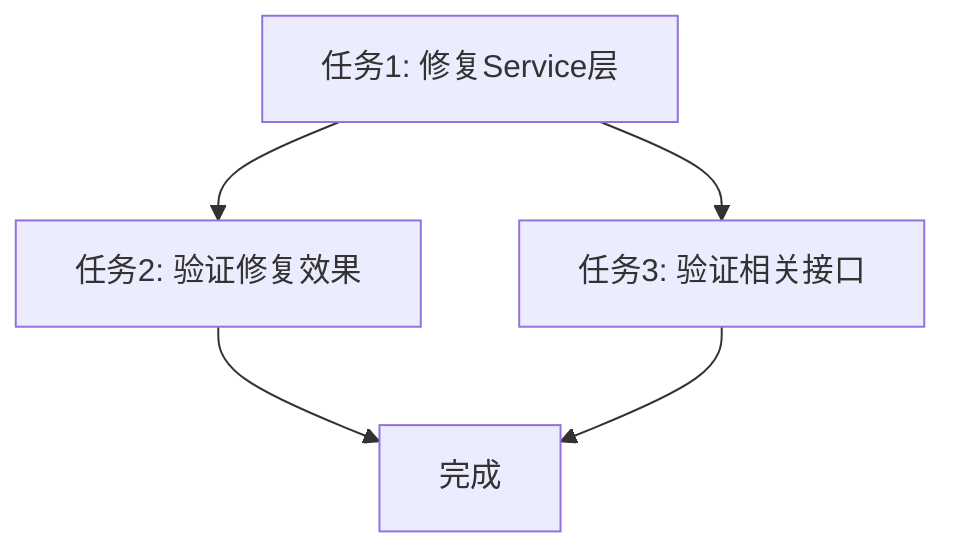

# 衣物查询权限修复任务清单

## 任务1: 修复Service层getClothingItems方法

### 输入契约
- **前置条件**: Controller层已正确传递userId
- **输入参数**: ClothingQueryOptions对象，包含userId字段
- **环境要求**: 后端服务运行正常

### 输出契约
- **输出**: 只包含当前用户衣物的分页数据
- **验收标准**: 
  - 只返回userId匹配的数据
  - 分页信息正确
  - 不影响其他查询参数

### 实现步骤
1. 修改`getClothingItems`方法，确保userId被正确传递
2. 验证参数传递链路的完整性

### 依赖关系
- **前置**: 无
- **后置**: 任务2、任务3
- **并行**: 无

## 任务2: 验证修复效果

### 输入契约
- **前置条件**: 任务1完成
- **测试用户**: userId=7 (sxk)
- **测试数据**: 确保userId=7有专属衣物数据

### 输出契约
- **输出**: 测试报告
- **验收标准**:
  - userId=7只能看到自己的衣物
  - 其他用户数据不可见
  - 分页功能正常

### 实现步骤
1. 创建测试数据
2. 使用curl测试API响应
3. 验证权限隔离

## 任务3: 验证相关接口

### 输入契约
- **前置条件**: 任务1完成
- **接口列表**:
  - GET /clothing/category/:categoryId
  - GET /clothing/search
  - GET /clothing/favorites

### 输出契约
- **输出**: 接口测试报告
- **验收标准**:
  - 所有接口都实现用户隔离
  - 功能完整性验证

### 依赖关系
- **前置**: 任务1
- **后置**: 无
- **并行**: 任务2

## 任务依赖图

