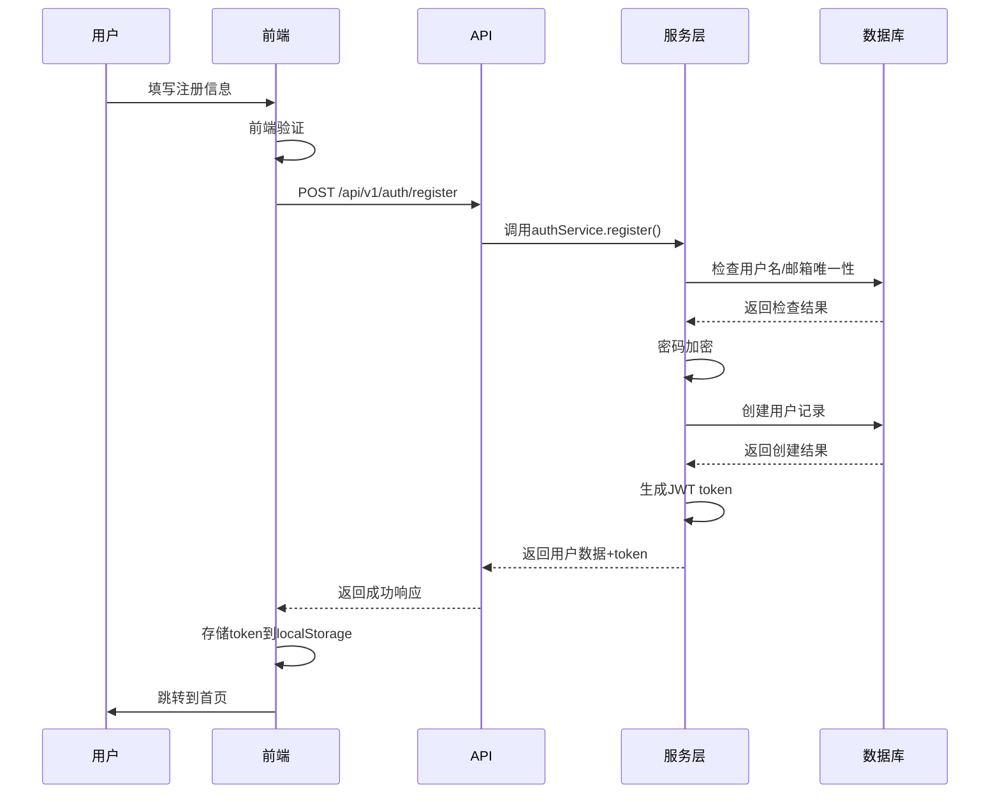
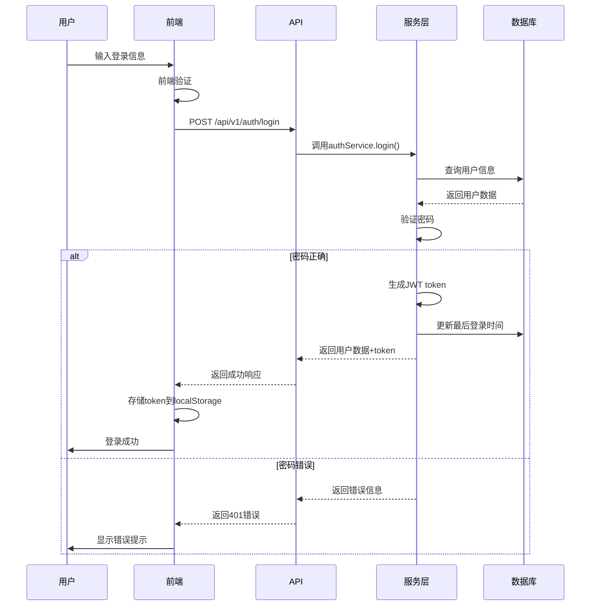
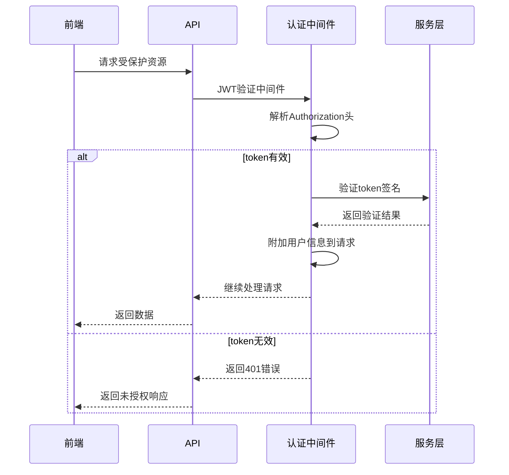

# 登录注册功能架构设计文档

## 整体架构概览

### 系统分层架构
```
┌─────────────────────────────────────────┐
│              前端层 (Vue 3)               │
├─────────────────────────────────────────┤
│           状态管理层 (Pinia)              │
├─────────────────────────────────────────┤
│           服务层 (Services)               │
├─────────────────────────────────────────┤
│           API客户端 (Axios)               │
├─────────────────────────────────────────┤
│           后端API层 (Express)             │
├─────────────────────────────────────────┤
│         业务逻辑层 (Services)             │
├─────────────────────────────────────────┤
│         数据访问层 (Sequelize)            │
├─────────────────────────────────────────┤
│           数据存储层 (MySQL)              │
└─────────────────────────────────────────┘
```

## 核心组件架构

### 1. 后端架构设计

#### 1.1 路由层 (Routes)
```
src/routes/auth.routes.ts
├── POST /register     → 用户注册
├── POST /login        → 用户登录
├── POST /logout       → 用户登出
├── GET  /profile      → 获取用户信息
├── PUT  /profile      → 更新用户信息
└── PUT  /password     → 修改密码
```

#### 1.2 中间件层 (Middleware)
```
src/middleware/
├── auth.middleware.ts      → JWT验证中间件
├── validation.middleware.ts → 请求验证中间件
├── error.middleware.ts   → 错误处理中间件
└── rateLimit.middleware.ts → 限流中间件
```

#### 1.3 服务层 (Services)
```
src/services/
├── auth.service.ts       → 认证业务逻辑
├── user.service.ts       → 用户管理服务
├── token.service.ts      → JWT token管理
└── password.service.ts   → 密码加密验证
```

#### 1.4 控制器层 (Controllers)
```
src/controllers/
├── auth.controller.ts    → 认证请求处理
└── user.controller.ts    → 用户管理请求处理
```

### 2. 前端架构设计

#### 2.1 组件架构
```
src/components/
├── auth/
│   ├── LoginForm.vue     → 登录表单组件
│   ├── RegisterForm.vue  → 注册表单组件
│   └── PasswordReset.vue → 密码重置组件
├── user/
│   ├── UserProfile.vue   → 用户资料组件
│   └── UserSettings.vue  → 用户设置组件
└── common/
    ├── AuthGuard.vue     → 路由守卫组件
    └── ErrorBoundary.vue → 错误边界组件
```

#### 2.2 Store架构
```
src/stores/
├── modules/
│   └── authStore.js      → 认证状态管理
├── plugins/
│   └── authPlugin.js     → 认证持久化插件
└── helpers/
    └── authHelpers.js    → 认证工具函数
```

#### 2.3 服务层
```
src/services/
├── api/
│   ├── authApi.js        → 认证API接口
│   └── userApi.js        → 用户管理API接口
├── adapters/
│   └── authAdapter.js    → 认证数据适配器
└── validators/
    └── authValidators.js → 表单验证规则
```

## 数据流设计

### 1. 用户注册流程


### 2. 用户登录流程


### 3. JWT认证流程


## 数据库设计

### 用户表增强
```sql
-- 现有users表已包含基础字段
-- 需要添加的字段：
ALTER TABLE users 
ADD COLUMN IF NOT EXISTS refresh_token VARCHAR(255) NULL,
ADD COLUMN IF NOT EXISTS token_expires_at TIMESTAMP NULL,
ADD COLUMN IF NOT EXISTS login_attempts INT DEFAULT 0,
ADD COLUMN IF NOT EXISTS lock_until TIMESTAMP NULL;

-- 索引优化
CREATE INDEX idx_users_refresh_token ON users(refresh_token);
CREATE INDEX idx_users_token_expires ON users(token_expires_at);
```

### 会话管理表 (后续扩展)
```sql
CREATE TABLE user_sessions (
    id VARCHAR(36) PRIMARY KEY,
    user_id VARCHAR(36) NOT NULL,
    refresh_token VARCHAR(255) NOT NULL,
    expires_at TIMESTAMP NOT NULL,
    ip_address VARCHAR(45),
    user_agent TEXT,
    created_at TIMESTAMP DEFAULT CURRENT_TIMESTAMP,
    FOREIGN KEY (user_id) REFERENCES users(id) ON DELETE CASCADE,
    INDEX idx_user_sessions_user_id (user_id),
    INDEX idx_user_sessions_refresh_token (refresh_token)
);
```

## 接口契约定义

### 1. 注册接口
```typescript
// 请求
interface RegisterRequest {
  username: string;    // 3-50字符
  email: string;      // 有效邮箱
  password: string;   // 最少6字符
  avatarUrl?: string; // 可选
}

// 响应
interface RegisterResponse {
  success: boolean;
  data: {
    user: UserProfile;
    token: string;
  };
  message: string;
}
```

### 2. 登录接口
```typescript
// 请求
interface LoginRequest {
  usernameOrEmail: string; // 用户名或邮箱
  password: string;       // 密码
}

// 响应
interface LoginResponse {
  success: boolean;
  data: {
    user: UserProfile;
    token: string;
  };
  message: string;
}
```

### 3. 用户信息接口
```typescript
// 用户资料
interface UserProfile {
  id: string;
  username: string;
  email: string;
  avatarUrl?: string;
  preferences: UserPreferences;
  createdAt: string;
  lastLoginAt?: string;
}

// 更新请求
interface UpdateProfileRequest {
  username?: string;
  email?: string;
  avatarUrl?: string;
  preferences?: Partial<UserPreferences>;
}
```

## 安全设计

### 1. 认证安全
- **JWT签名**: HS256算法 + 密钥
- **Token过期**: Access(2h) + Refresh(7d)
- **Token撤销**: 登出时失效
- **密码策略**: bcryptjs加密 + 盐值

### 2. 输入验证
- **SQL注入**: Sequelize ORM防止
- **XSS防护**: 输入清理 + 输出编码
- **CSRF防护**: JWT无状态天然防护
- **速率限制**: 登录尝试限制

### 3. 数据保护
- **敏感信息**: 密码哈希存储
- **传输安全**: HTTPS强制执行
- **错误信息**: 不泄露敏感数据
- **日志记录**: 安全事件追踪

## 异常处理策略

### 1. 认证异常
```typescript
class AuthError extends Error {
  constructor(
    public code: string,
    public statusCode: number,
    message: string
  ) {
    super(message);
  }
}

// 错误类型定义
const AUTH_ERRORS = {
  INVALID_CREDENTIALS: new AuthError('AUTH_001', 401, '用户名或密码错误'),
  USER_NOT_FOUND: new AuthError('AUTH_002', 404, '用户不存在'),
  TOKEN_EXPIRED: new AuthError('AUTH_003', 401, 'Token已过期'),
  TOKEN_INVALID: new AuthError('AUTH_004', 401, 'Token无效'),
  USER_EXISTS: new AuthError('AUTH_005', 409, '用户名或邮箱已存在'),
  ACCOUNT_LOCKED: new AuthError('AUTH_006', 423, '账户已锁定')
};
```

### 2. 前端错误处理
```typescript
// 统一错误处理
const handleAuthError = (error: any) => {
  const errorMap = {
    'AUTH_001': '用户名或密码错误',
    'AUTH_002': '用户不存在',
    'AUTH_003': '登录已过期，请重新登录',
    'AUTH_004': '登录信息无效',
    'AUTH_005': '用户名或邮箱已被使用',
    'AUTH_006': '账户已锁定，请联系客服'
  };
  
  const message = errorMap[error.code] || '操作失败，请稍后重试';
  showToast(message, 'error');
};
```

## 性能优化

### 1. 数据库优化
- **索引**: username, email唯一索引
- **查询优化**: 预加载关联数据
- **连接池**: Sequelize连接池配置

### 2. API优化
- **响应压缩**: gzip压缩
- **缓存策略**: Redis缓存用户信息
- **分页**: 用户列表分页查询

### 3. 前端优化
- **懒加载**: 路由懒加载
- **防抖**: 表单输入防抖
- **缓存**: API响应缓存

## 监控与日志

### 1. 后端监控
```typescript
// 登录日志
interface LoginLog {
  userId: string;
  ip: string;
  userAgent: string;
  success: boolean;
  timestamp: Date;
  error?: string;
}

// 安全事件
interface SecurityEvent {
  type: 'login_failed' | 'account_locked' | 'token_refresh';
  userId: string;
  metadata: Record<string, any>;
  timestamp: Date;
}
```

### 2. 前端监控
- **性能监控**: 登录响应时间
- **错误监控**: 认证错误统计
- **用户行为**: 登录/注册转化率

## 部署架构

### 1. 环境配置
```bash
# 开发环境
.env.development
VITE_API_BASE_URL=http://localhost:3000/api/v1

# 生产环境
.env.production
VITE_API_BASE_URL=https://api.stylevault.com/api/v1
```

### 2. 容器化部署
```dockerfile
# Dockerfile.backend
FROM node:18-alpine
WORKDIR /app
COPY package*.json ./
RUN npm ci --only=production
COPY . .
EXPOSE 3000
CMD ["npm", "start"]

# Dockerfile.frontend
FROM node:18-alpine as build
WORKDIR /app
COPY package*.json ./
RUN npm ci
COPY . .
RUN npm run build

FROM nginx:alpine
COPY --from=build /app/dist /usr/share/nginx/html
COPY nginx.conf /etc/nginx/conf.d/default.conf
EXPOSE 80
```

## 测试策略

### 1. 单元测试
- **后端**: Jest + Supertest
- **前端**: Vitest + Vue Test Utils
- **覆盖率**: >80%

### 2. 集成测试
- **API测试**: 所有认证端点
- **数据库**: 用户CRUD操作
- **端到端**: 完整登录流程

### 3. 性能测试
- **负载测试**: 并发登录测试
- **压力测试**: 数据库连接池
- **安全测试**: 认证绕过测试