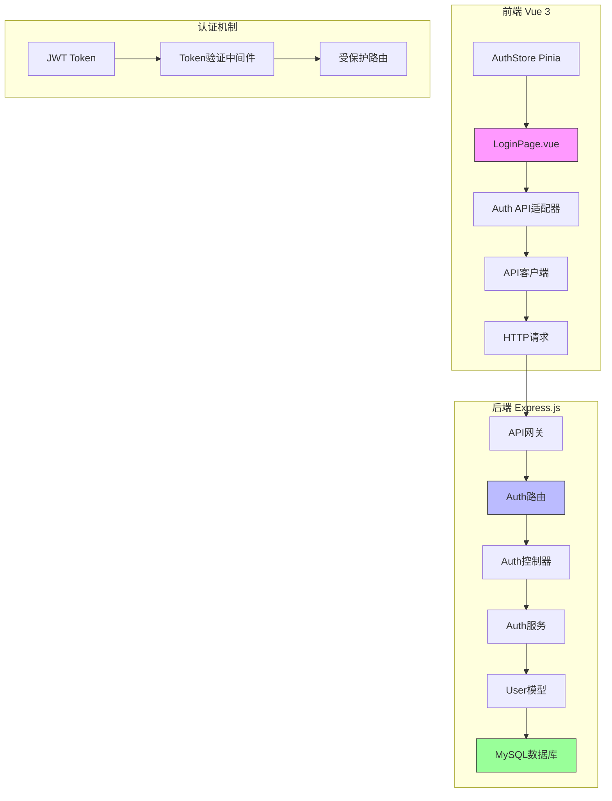
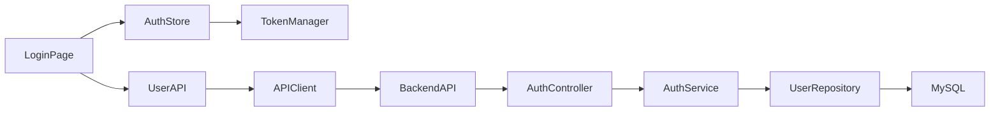
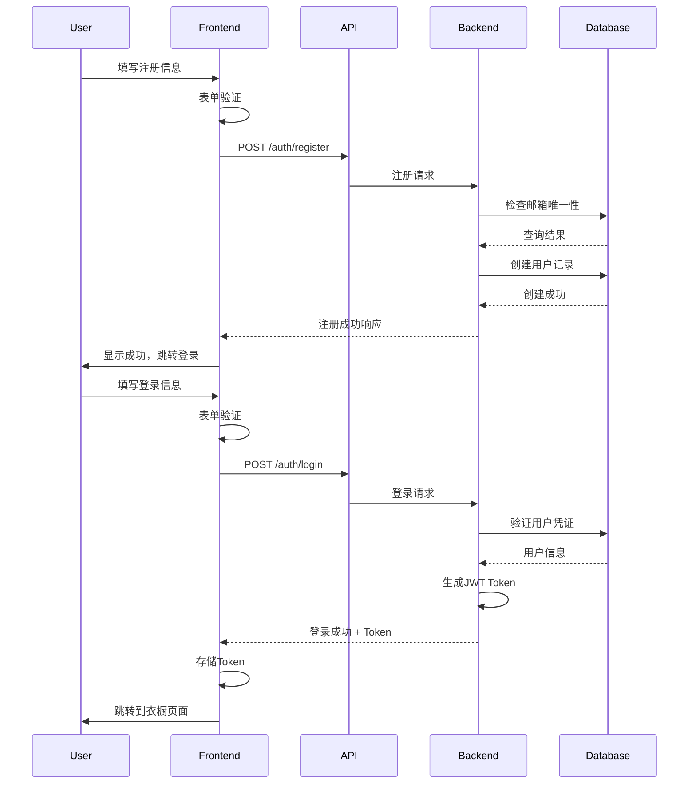

# 登录注册功能系统架构设计

## 整体架构图



## 分层设计

### 1. 表现层 (Presentation Layer)
- **LoginPage.vue**: 用户界面，保持现有样式不变
- **表单验证**: 前端实时验证
- **错误提示**: 统一的用户反馈

### 2. 应用层 (Application Layer)
- **AuthStore**: Pinia状态管理
  - 用户登录状态
  - Token管理
  - 用户信息缓存
- **API适配器**: 统一API调用接口

### 3. 领域层 (Domain Layer)
- **Auth服务**: 业务逻辑处理
  - 用户注册逻辑
  - 用户认证逻辑
  - 密码验证逻辑
- **User实体**: 用户数据模型

### 4. 基础设施层 (Infrastructure Layer)
- **数据库**: MySQL用户表
- **JWT**: Token生成与验证
- **密码加密**: bcrypt密码哈希

## 模块依赖关系



## 接口契约定义

### 前端接口 (UserAPI)
```typescript
interface UserAPI {
  login(credentials: LoginCredentials): Promise<AuthResponse>
  register(userData: RegisterData): Promise<AuthResponse>
  logout(): Promise<void>
  getProfile(): Promise<UserProfile>
}

interface LoginCredentials {
  email: string
  password: string
}

interface RegisterData {
  username: string
  email: string
  password: string
}

interface AuthResponse {
  success: boolean
  message: string
  data: {
    token: string
    user: UserProfile
  }
}

interface UserProfile {
  id: number
  username: string
  email: string
  createdAt: string
}
```

### 后端接口 (RESTful API)

#### 用户注册
```http
POST /api/v1/auth/register
Content-Type: application/json

{
  "username": "string",
  "email": "string",
  "password": "string"
}

Response: 201 Created
{
  "success": true,
  "message": "用户注册成功",
  "data": {
    "user": {
      "id": 1,
      "username": "用户名",
      "email": "user@example.com",
      "createdAt": "2024-01-01T00:00:00.000Z"
    }
  }
}
```

#### 用户登录
```http
POST /api/v1/auth/login
Content-Type: application/json

{
  "email": "string",
  "password": "string"
}

Response: 200 OK
{
  "success": true,
  "message": "登录成功",
  "data": {
    "token": "jwt-token-string",
    "user": {
      "id": 1,
      "username": "用户名",
      "email": "user@example.com"
    }
  }
}
```

## 数据流向图



## 异常处理策略

### 前端异常处理
- **网络错误**: 显示"网络连接失败"
- **服务器错误**: 显示"服务器繁忙"
- **业务错误**: 显示具体错误信息
- **Token过期**: 自动清除本地存储，跳转登录

### 后端异常处理
- **400 Bad Request**: 参数验证失败
- **401 Unauthorized**: 认证失败
- **409 Conflict**: 邮箱已注册
- **500 Internal Server Error**: 服务器内部错误

### 统一错误响应格式
```json
{
  "success": false,
  "message": "错误描述信息",
  "error": {
    "code": "ERROR_CODE",
    "details": "详细错误信息"
  },
  "timestamp": "2024-01-01T00:00:00.000Z"
}
```

## 安全设计

### 密码安全
- **存储**: bcrypt加密，10轮salt
- **传输**: HTTPS加密
- **验证**: 服务端密码验证

### Token安全
- **签名**: JWT HMAC-SHA256签名
- **有效期**: 7天有效期
- **存储**: 客户端localStorage
- **刷新**: 暂不支持Token刷新

### 输入验证
- **邮箱格式**: 标准邮箱格式验证
- **密码长度**: 最小6位字符
- **用户名**: 2-20位字符，支持中英文
- **SQL注入**: 使用ORM防止SQL注入

## 性能优化

### 数据库优化
- **索引**: 邮箱字段唯一索引
- **查询优化**: 用户查询使用索引
- **连接池**: 数据库连接池配置

### API优化
- **响应压缩**: gzip压缩响应
- **缓存策略**: 用户信息缓存
- **限流**: API调用频率限制

## 测试策略

### 单元测试
- **前端**: 表单验证逻辑测试
- **后端**: 服务层逻辑测试
- **数据库**: 模型验证测试

### 集成测试
- **注册流程**: 完整注册流程测试
- **登录流程**: 完整登录流程测试
- **错误处理**: 各种异常情况测试

### 端到端测试
- **用户旅程**: 从注册到登录完整流程
- **跨浏览器**: 兼容性测试