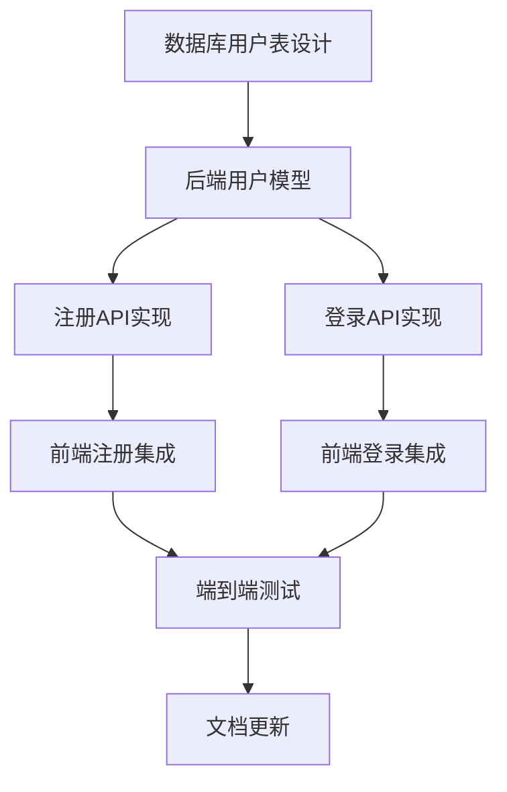

# 登录注册功能任务拆分

## 任务依赖图

## 原子任务列表

### 任务1: 数据库用户表设计
**优先级**: P0 (阻塞后续任务)
**复杂度**: 低
**预估时间**: 30分钟

#### 输入契约
- 数据库: MySQL已配置
- 需求: 用户注册登录数据存储
- 约束: 遵循现有数据库规范

#### 输出契约
- 用户表结构定义
- 迁移脚本
- 索引配置

#### 实现约束
- 使用Sequelize模型
- 邮箱唯一索引
- 密码字段加密存储
- 时间戳自动维护

#### 依赖关系
- 前置: 无
- 后置: 任务2

### 任务2: 后端用户模型实现
**优先级**: P0
**复杂度**: 中
**预估时间**: 45分钟

#### 输入契约
- 数据库表结构
- Sequelize框架
- JWT认证需求

#### 输出契约
- User模型类
- 实例方法: 密码验证
- 类方法: 用户查找
- 关联关系定义

#### 实现约束
- TypeScript类型定义
- 密码自动加密
- 验证规则
- 错误处理

#### 依赖关系
- 前置: 任务1
- 后置: 任务3,4

### 任务3: 注册API实现
**优先级**: P0
**复杂度**: 中
**预估时间**: 60分钟

#### 输入契约
- 用户模型
- Express路由框架
- 输入验证需求

#### 输出契约
- POST /api/v1/auth/register
- 请求验证中间件
- 业务逻辑处理
- 统一响应格式

#### 实现约束
- Joi输入验证
- 邮箱唯一性检查
- 密码加密存储
- 错误统一处理

#### 依赖关系
- 前置: 任务2
- 后置: 任务5

### 任务4: 登录API实现
**优先级**: P0
**复杂度**: 中
**预估时间**: 60分钟

#### 输入契约
- 用户模型
- JWT库
- bcrypt密码验证

#### 输出契约
- POST /api/v1/auth/login
- 用户凭证验证
- JWT Token生成
- 用户信息返回

#### 实现约束
- 密码验证逻辑
- Token有效期7天
- 响应包含用户基本信息
- 错误信息不泄露安全信息

#### 依赖关系
- 前置: 任务2
- 后置: 任务6

### 任务5: 前端注册集成
**优先级**: P1
**复杂度**: 低
**预估时间**: 45分钟

#### 输入契约
- 现有LoginPage.vue
- 注册API接口
- API适配器模式

#### 输出契约
- 替换模拟注册为真实API
- 保持现有UI不变
- 错误处理集成
- 注册成功跳转逻辑

#### 实现约束
- 保持表单验证逻辑
- 使用现有错误提示样式
- 注册成功后预填邮箱
- 不改变组件结构

#### 依赖关系
- 前置: 任务3
- 后置: 任务7

### 任务6: 前端登录集成
**优先级**: P1
**复杂度**: 低
**预估时间**: 45分钟

#### 输入契约
- 现有LoginPage.vue
- 登录API接口
- AuthStore状态管理

#### 输出契约
- 替换模拟登录为真实API
- Token存储到localStorage
- 登录状态同步
- 跳转到衣橱页面

#### 实现约束
- 保持现有UI和动画
- 使用现有错误处理
- Token持久化存储
- 不改变现有用户体验

#### 依赖关系
- 前置: 任务4
- 后置: 任务7

### 任务7: 端到端测试
**优先级**: P2
**复杂度**: 中
**预估时间**: 60分钟

#### 输入契约
- 完整的前后端功能
- 测试环境配置
- 测试数据准备

#### 输出契约
- 注册流程测试
- 登录流程测试
- 错误场景测试
- 测试报告

#### 实现约束
- 使用现有测试框架
- 覆盖主要用户场景
- 测试数据隔离
- 自动化测试脚本

#### 依赖关系
- 前置: 任务5,6
- 后置: 任务8

### 任务8: 文档更新
**优先级**: P2
**复杂度**: 低
**预估时间**: 30分钟

#### 输入契约
- 完成功能实现
- API接口文档
- 使用说明

#### 输出契约
- API文档更新
- 部署说明
- 使用指南
- 故障排除

#### 实现约束
- 与现有文档保持一致
- 包含示例请求
- 错误码说明
- 部署步骤清晰

#### 依赖关系
- 前置: 任务7
- 后置: 无

## 任务执行计划

### 阶段1: 后端基础 (任务1-4)
**执行顺序**: 串行执行
**总时间**: 3.5小时
**关键路径**: 任务1 → 任务2 → 任务3 → 任务4

### 阶段2: 前端集成 (任务5-6)
**执行顺序**: 可并行执行
**总时间**: 45分钟
**依赖**: 等待后端API完成

### 阶段3: 测试与文档 (任务7-8)
**执行顺序**: 串行执行
**总时间**: 1.5小时
**依赖**: 前端集成完成

## 风险评估

### 高风险项
1. **数据库连接**: MySQL连接配置可能有问题
2. **CORS配置**: 前后端跨域可能有问题
3. **密码加密**: bcrypt在ARM架构下的兼容性

### 应对措施
1. **提前验证**: 先测试数据库连接
2. **CORS预设**: 配置允许前端域名
3. **架构兼容**: 使用兼容ARM的bcrypt版本

## 质量检查清单

### 每个任务完成后检查
- [ ] 代码符合项目规范
- [ ] 单元测试通过
- [ ] 接口文档更新
- [ ] 错误处理完善
- [ ] 性能满足要求

### 整体验收标准
- [ ] 注册功能完整可用
- [ ] 登录功能完整可用
- [ ] 现有UI保持不变
- [ ] 错误提示准确
- [ ] 安全机制到位
- [ ] 文档完整准确