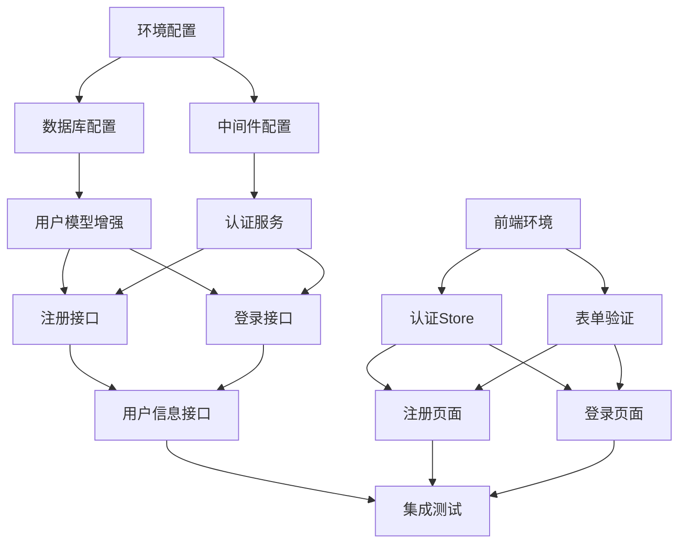

# 登录注册功能任务分解文档

## 项目总览
- **总工期**: 3天
- **任务数量**: 12个原子任务
- **并行度**: 后端6个任务，前端6个任务
- **依赖关系**: 后端优先，前后端并行

## 任务依赖图

## 后端任务分解

### 阶段1: 基础设施 (第1天)

#### 任务1: 环境配置和依赖安装
- **编号**: BE-001
- **预估时间**: 2小时
- **前置条件**: 项目已克隆
- **具体步骤**:
  1. 安装JWT相关依赖
  2. 配置环境变量模板
  3. 更新package.json脚本
- **验收标准**: `npm install` 成功，环境变量文件创建
- **输出物**: `.env.example`, `package.json`更新

#### 任务2: 数据库配置优化
- **编号**: BE-002
- **预估时间**: 1小时
- **前置条件**: BE-001完成
- **具体步骤**:
  1. 检查users表结构
  2. 添加必要的索引
  3. 创建数据库迁移脚本
- **验收标准**: 数据库迁移成功，索引创建完成
- **输出物**: 数据库迁移文件

#### 任务3: 认证中间件开发
- **编号**: BE-003
- **预估时间**: 3小时
- **前置条件**: BE-001完成
- **具体步骤**:
  1. 创建JWT工具类
  2. 开发认证中间件
  3. 开发错误处理中间件
  4. 开发验证中间件
- **验收标准**: 中间件单元测试通过
- **输出物**: `src/middleware/auth.middleware.ts`等

### 阶段2: 核心业务逻辑 (第2天)

#### 任务4: 用户模型增强
- **编号**: BE-004
- **预估时间**: 2小时
- **前置条件**: BE-002完成
- **具体步骤**:
  1. 增强User模型验证
  2. 添加实例方法
  3. 添加类方法
- **验收标准**: 模型验证测试通过
- **输出物**: 更新的`User.ts`模型

#### 任务5: 认证服务开发
- **编号**: BE-005
- **预估时间**: 3小时
- **前置条件**: BE-003完成
- **具体步骤**:
  1. 创建AuthService类
  2. 实现注册逻辑
  3. 实现登录逻辑
  4. 实现密码验证
- **验收标准**: 服务层单元测试通过
- **输出物**: `src/services/auth.service.ts`

#### 任务6: 注册接口开发
- **编号**: BE-006
- **预估时间**: 2小时
- **前置条件**: BE-004, BE-005完成
- **具体步骤**:
  1. 创建注册路由
  2. 实现注册控制器
  3. 添加验证规则
  4. 错误处理
- **验收标准**: API测试通过，返回正确格式
- **输出物**: `src/routes/auth.routes.ts`注册端点

#### 任务7: 登录接口开发
- **编号**: BE-007
- **预估时间**: 2小时
- **前置条件**: BE-004, BE-005完成
- **具体步骤**:
  1. 创建登录路由
  2. 实现登录控制器
  3. 生成JWT token
  4. 更新最后登录时间
- **验收标准**: API测试通过，token正确生成
- **输出物**: 登录端点代码

#### 任务8: 用户信息接口开发
- **编号**: BE-008
- **预估时间**: 2小时
- **前置条件**: BE-006, BE-007完成
- **具体步骤**:
  1. 创建用户信息路由
  2. 实现用户信息控制器
  3. 实现用户信息更新
  4. 添加认证保护
- **验收标准**: 需要token才能访问
- **输出物**: 用户信息CRUD端点

## 前端任务分解

### 阶段1: 基础架构 (第1天)

#### 任务9: 前端环境配置
- **编号**: FE-001
- **预估时间**: 1小时
- **前置条件**: 项目已克隆
- **具体步骤**:
  1. 配置Axios基础设置
  2. 配置环境变量
  3. 设置API基础路径
- **验收标准**: Axios能正确调用后端API
- **输出物**: `src/config/api.js`

#### 任务10: 认证Store开发
- **编号**: FE-002
- **预估时间**: 3小时
- **前置条件**: FE-001完成
- **具体步骤**:
  1. 创建AuthStore
  2. 实现登录状态管理
  3. 实现token存储
  4. 实现用户信息缓存
- **验收标准**: Store单元测试通过
- **输出物**: `src/stores/authStore.js`

#### 任务11: 表单验证开发
- **编号**: FE-003
- **预估时间**: 2小时
- **前置条件**: FE-001完成
- **具体步骤**:
  1. 创建验证规则
  2. 实现错误提示
  3. 实现实时验证
  4. 添加防抖处理
- **验收标准**: 验证规则完整，用户体验良好
- **输出物**: `src/utils/validators.js`

### 阶段2: 界面开发 (第2天)

#### 任务12: 注册页面开发
- **编号**: FE-004
- **预估时间**: 3小时
- **前置条件**: FE-002, FE-003完成
- **具体步骤**:
  1. 创建注册页面组件
  2. 实现注册表单
  3. 集成表单验证
  4. 处理注册成功/失败
- **验收标准**: 注册功能完整，用户体验良好
- **输出物**: `src/views/auth/Register.vue`

#### 任务13: 登录页面开发
- **编号**: FE-005
- **预估时间**: 3小时
- **前置条件**: FE-002, FE-003完成
- **具体步骤**:
  1. 创建登录页面组件
  2. 实现登录表单
  3. 集成表单验证
  4. 处理登录成功/失败
- **验收标准**: 登录功能完整，token正确存储
- **输出物**: `src/views/auth/Login.vue`

#### 任务14: 用户信息页面开发
- **编号**: FE-006
- **预估时间**: 2小时
- **前置条件**: FE-002完成
- **具体步骤**:
  1. 创建用户信息页面
  2. 显示用户资料
  3. 实现编辑功能
  4. 添加认证路由守卫
- **验收标准**: 需要登录才能访问
- **输出物**: `src/views/user/Profile.vue`

## 集成测试任务

### 阶段3: 集成验证 (第3天)

#### 任务15: API集成测试
- **编号**: INT-001
- **预估时间**: 2小时
- **前置条件**: 所有后端任务完成
- **具体步骤**:
  1. 测试注册API
  2. 测试登录API
  3. 测试用户信息API
  4. 测试认证保护
- **验收标准**: 所有API测试通过
- **输出物**: 测试报告

#### 任务16: 前端集成测试
- **编号**: INT-002
- **预估时间**: 2小时
- **前置条件**: 所有前端任务完成
- **具体步骤**:
  1. 测试注册流程
  2. 测试登录流程
  3. 测试用户信息展示
  4. 测试token持久化
- **验收标准**: 前端功能测试通过
- **输出物**: 测试报告

#### 任务17: 端到端测试
- **编号**: INT-003
- **预估时间**: 2小时
- **前置条件**: INT-001, INT-002完成
- **具体步骤**:
  1. 完整注册登录流程
  2. 用户信息更新流程
  3. 错误处理测试
  4. 性能测试
- **验收标准**: 端到端测试通过
- **输出物**: 最终测试报告

## 每日详细计划

### 第1天: 基础设施搭建
**上午 (9:00-12:00)**
- 9:00-10:00: 任务1 - 环境配置
- 10:00-11:00: 任务2 - 数据库配置
- 11:00-12:00: 任务9 - 前端环境配置

**下午 (14:00-18:00)**
- 14:00-17:00: 任务3 - 认证中间件开发
- 17:00-18:00: 任务10 - 认证Store开发

### 第2天: 核心业务开发
**上午 (9:00-12:00)**
- 9:00-11:00: 任务4 - 用户模型增强
- 11:00-12:00: 任务5 - 认证服务开发

**下午 (14:00-18:00)**
- 14:00-16:00: 任务6 - 注册接口开发
- 16:00-17:00: 任务7 - 登录接口开发
- 17:00-18:00: 任务8 - 用户信息接口开发

### 第3天: 界面和集成
**上午 (9:00-12:00)**
- 9:00-11:00: 任务12 - 注册页面开发
- 11:00-12:00: 任务13 - 登录页面开发

**下午 (14:00-18:00)**
- 14:00-15:00: 任务14 - 用户信息页面开发
- 15:00-17:00: 任务15-17 - 集成测试
- 17:00-18:00: 文档整理和部署

## 资源需求

### 开发资源
- **后端开发者**: 1人
- **前端开发者**: 1人
- **测试工程师**: 1人 (第3天参与)

### 技术资源
- **开发环境**: Node.js 18+, MySQL 8+
- **测试工具**: Postman, Jest, Vitest
- **版本控制**: Git + GitHub

### 环境需求
- **本地开发**: localhost:3000 (后端)
- **本地开发**: localhost:5173 (前端)
- **测试环境**: 独立测试数据库

## 风险识别和应对

### 技术风险
1. **JWT配置问题** → 提前准备配置模板
2. **数据库连接问题** → 准备数据库配置脚本
3. **CORS配置问题** → 提前配置CORS中间件

### 进度风险
1. **任务延期** → 预留20%缓冲时间
2. **依赖阻塞** → 并行开发，提前沟通
3. **测试失败** → 增加测试时间预留

### 质量风险
1. **安全漏洞** → 代码审查 + 安全测试
2. **性能问题** → 性能测试 + 优化
3. **用户体验** → 用户测试 + 反馈收集

## 验收检查清单

### 功能验收
- [ ] 用户可注册新账户
- [ ] 用户可使用注册信息登录
- [ ] JWT token正确生成和存储
- [ ] 用户信息可查看和编辑
- [ ] 密码修改功能正常工作

### 技术验收
- [ ] 所有API测试通过
- [ ] 前端功能测试通过
- [ ] 端到端测试通过
- [ ] 代码覆盖率>80%
- [ ] 文档完整更新

### 安全验收
- [ ] 密码加密存储验证
- [ ] JWT认证正常工作
- [ ] 输入验证完整
- [ ] 错误处理正确
- [ ] 无安全漏洞

## 后续维护计划

### 版本1.1 (2周后)
- 邮箱验证功能
- 密码重置功能
- 登录历史记录

### 版本1.2 (1个月后)
- 第三方登录
- 双因素认证
- 用户权限管理

### 长期维护
- 安全更新
- 性能优化
- 功能扩展
- 用户反馈处理