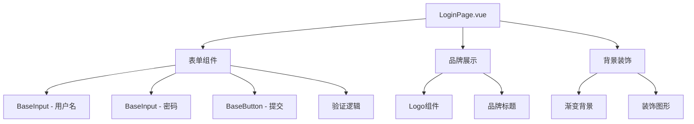
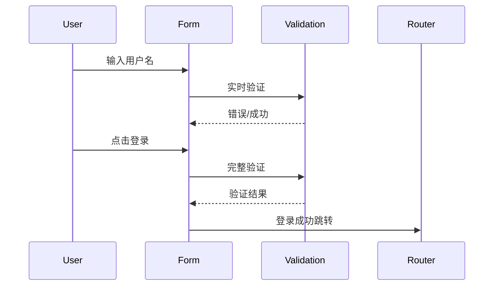

# 登录页面设计 - 系统架构文档

## 整体架构



## 分层设计

### 1. 页面层 (LoginPage.vue)
- **职责**: 整体页面布局、状态管理、路由跳转
- **输入**: 无（独立页面）
- **输出**: 登录成功事件、路由跳转

### 2. 表单组件层
- **BaseInput**: 用户名、密码输入框
- **BaseButton**: 提交按钮
- **表单验证**: 实时验证 + 提交验证

### 3. 品牌展示层
- **Logo**: StyleVault品牌标识
- **标题**: 品牌名称和标语
- **视觉**: 渐变背景 + 装饰元素

## 接口契约

### Props接口
```typescript
interface LoginForm {
  username: string
  password: string
  rememberMe: boolean
}

interface ValidationErrors {
  username?: string
  password?: string
}
```

### 事件接口
```typescript
interface LoginEvents {
  submit: LoginForm
  navigateToRegister: void
  navigateToForgotPassword: void
}
```

## 数据流向



## 响应式设计

### 断点策略
- **Mobile**: < 768px (单列布局)
- **Tablet**: 768px - 1024px (居中卡片)
- **Desktop**: > 1024px (左右分栏)

### 布局适配
```css
/* Mobile: 全屏卡片 */
/* Tablet: 居中卡片 */
/* Desktop: 左侧品牌 + 右侧表单 */
```

## 异常处理策略

### 表单验证错误
- 实时显示错误信息
- 提交时高亮错误字段
- 错误状态持久化到组件状态

### 网络错误
- 加载状态指示
- 错误提示信息
- 重试机制

### 无障碍支持
- ARIA标签完整
- 键盘导航支持
- 屏幕阅读器友好

## 设计令牌应用

### 颜色系统
- 主背景: `bg-gradient-to-br from-primary-50 to-secondary-50`
- 卡片背景: `bg-white`
- 主按钮: `bg-primary-600 hover:bg-primary-700`
- 错误提示: `text-error-600`

### 间距系统
- 卡片内边距: `p-8`
- 表单间距: `space-y-6`
- 按钮间距: `mt-8`