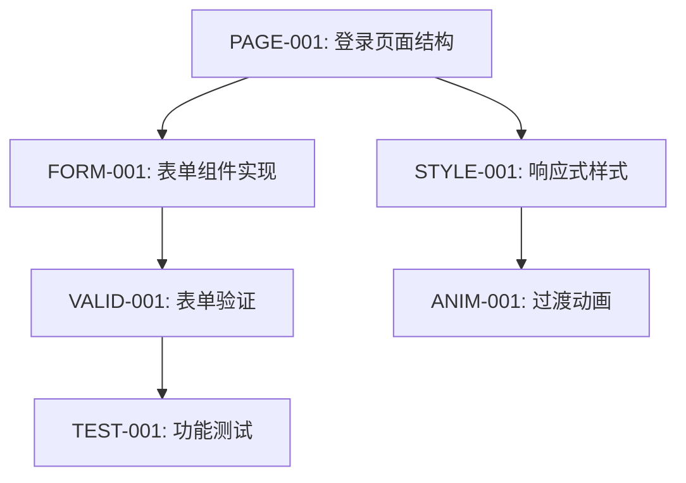

# 登录页面设计 - 原子任务分解

## 任务依赖图



## 原子任务列表

### PAGE-001: 登录页面结构
**预估时间**: 30分钟  
**前置条件**: 无  
**输入**: 设计令牌系统、基础组件  
**输出**: LoginPage.vue基础结构  

**具体步骤**:
1. 创建页面文件 `src/views/LoginPage.vue`
2. 设置基础模板结构
3. 引入MainLayout组件
4. 设置页面标题和meta信息

**验收标准**:
- ✅ 文件创建成功
- ✅ 基础HTML结构完整
- ✅ 引入依赖正确

---

### FORM-001: 表单组件实现
**预估时间**: 45分钟  
**前置条件**: PAGE-001  
**输入**: BaseInput、BaseButton组件  
**输出**: 完整表单界面  

**具体步骤**:
1. 使用BaseInput实现用户名输入
2. 使用BaseInput实现密码输入（type=password）
3. 使用BaseButton实现提交按钮
4. 添加"记住我"复选框
5. 添加辅助链接（注册、忘记密码）

**验收标准**:
- ✅ 表单字段完整
- ✅ 组件使用正确
- ✅ 布局美观

---

### STYLE-001: 响应式样式
**预估时间**: 40分钟  
**前置条件**: PAGE-001, FORM-001  
**输入**: 设计令牌、Tailwind配置  
**输出**: 响应式样式系统  

**具体步骤**:
1. 实现移动端样式（全屏卡片）
2. 实现平板端样式（居中卡片）
3. 实现桌面端样式（左右分栏）
4. 添加渐变背景
5. 实现品牌展示区域

**验收标准**:
- ✅ 三端响应式正常
- ✅ 视觉效果一致
- ✅ 品牌元素完整

---

### VALID-001: 表单验证
**预估时间**: 35分钟  
**前置条件**: FORM-001  
**输入**: 表单数据  
**输出**: 验证逻辑和错误处理  

**具体步骤**:
1. 实现用户名验证（必填、格式）
2. 实现密码验证（必填、最小长度）
3. 添加实时验证反馈
4. 实现提交验证
5. 添加错误提示样式

**验收标准**:
- ✅ 验证规则正确
- ✅ 错误提示清晰
- ✅ 用户体验良好

---

### ANIM-001: 过渡动画
**预估时间**: 20分钟  
**前置条件**: STYLE-001  
**输入**: 页面元素  
**输出**: 平滑过渡动画  

**具体步骤**:
1. 添加页面加载动画
2. 实现表单字段焦点动画
3. 添加按钮交互反馈
4. 实现错误提示动画

**验收标准**:
- ✅ 动画流畅自然
- ✅ 不影响性能
- ✅ 无障碍支持

---

### TEST-001: 功能测试
**预估时间**: 15分钟  
**前置条件**: VALID-001, ANIM-001  
**输入**: 完整页面  
**输出**: 测试验证  

**具体步骤**:
1. 验证表单提交流程
2. 测试响应式布局
3. 检查无障碍支持
4. 验证错误处理

**验收标准**:
- ✅ 功能完整可用
- ✅ 响应式正常
- ✅ 无障碍通过

## 开发计划

### 第1天 (2小时)
- **09:00-09:30**: PAGE-001 页面结构
- **09:30-10:15**: FORM-001 表单实现
- **10:15-10:55**: STYLE-001 响应式样式
- **10:55-11:30**: VALID-001 表单验证
- **11:30-11:50**: ANIM-001 过渡动画
- **11:50-12:05**: TEST-001 功能测试

## 技术栈和工具

- **框架**: Vue 3.5.19 + Composition API
- **样式**: TailwindCSS + 设计令牌
- **组件**: BaseInput, BaseButton (复用现有)
- **图标**: Font Awesome
- **路由**: Vue Router
- **测试**: 手动功能测试

## 文件结构规划

```
src/
├── views/
│   └── LoginPage.vue          # 主登录页面
├── styles/
│   └── login.css             # 专用样式（如需要）
└── components/
    └── login/
        └── LoginForm.vue     # 表单组件（如拆分）
```

## 验收检查清单

### 功能验收
- [ ] 用户名/密码输入正常
- [ ] 表单验证工作正常
- [ ] 响应式布局适配
- [ ] 品牌展示完整
- [ ] 动画效果流畅

### 质量验收
- [ ] 代码风格一致
- [ ] 无障碍支持完整
- [ ] 性能优化到位
- [ ] 设计系统一致
- [ ] 移动端友好