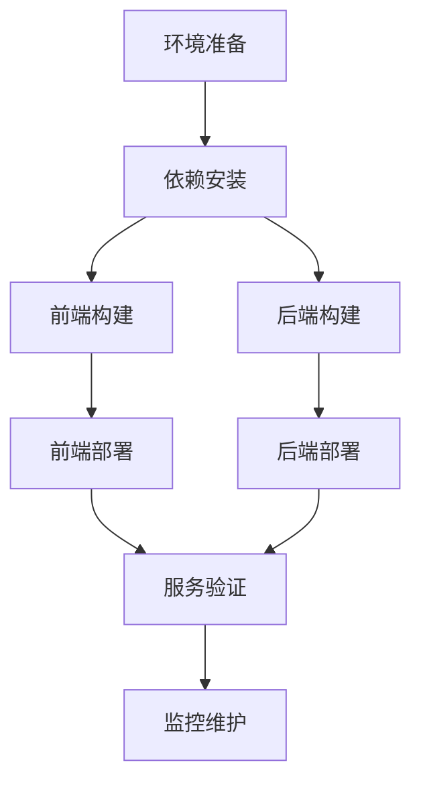

# StyleVault 项目编译打包部署全流程文档

## 项目概述

StyleVault 是一个完整的前后端分离项目，包含：
- **前端**：Vue 3 + Vite + TypeScript + TailwindCSS
- **后端**：Node.js + TypeScript + Express + Sequelize + MySQL

## 一、环境准备

### 1. 系统要求
- **Node.js**：v18.0.0 或更高版本
- **npm**：v8.0.0 或更高版本
- **MySQL**：v5.7 或更高版本
- **Git**：最新版本

### 2. 环境配置

#### 前端环境配置
```bash
# 进入前端目录
cd /Users/sunxiaokai/Desktop/stylevault-vue-project/front

# 安装依赖（针对 ARM 架构 macOS）
npm install --target_arch=arm64
```

#### 后端环境配置
```bash
# 进入后端目录
cd /Users/sunxiaokai/Desktop/stylevault-vue-project/backend

# 安装依赖（针对 ARM 架构 macOS）
npm install --target_arch=arm64

# 配置环境变量
# 复制 .env 文件并根据实际情况修改配置
```

## 二、编译打包流程

### 1. 前端编译打包

#### 步骤 1：进入前端目录
```bash
cd /Users/sunxiaokai/Desktop/stylevault-vue-project/front
```

#### 步骤 2：运行构建命令
```bash
# 执行构建
npm run build

# 构建完成后，生成的文件会在 dist 目录中
```

#### 前端构建配置说明
- **构建输出目录**：`dist`
- **源码映射**：关闭（`sourcemap: false`）
- **构建产物**：包含压缩后的 HTML、CSS、JavaScript 文件

### 2. 后端编译打包

#### 步骤 1：进入后端目录
```bash
cd /Users/sunxiaokai/Desktop/stylevault-vue-project/backend
```

#### 步骤 2：运行构建命令
```bash
# 执行 TypeScript 编译
npm run build

# 构建完成后，生成的文件会在 dist 目录中
```

#### 后端构建配置说明
- **构建输出目录**：`dist`
- **TypeScript 配置**：严格模式，支持装饰器
- **构建产物**：编译后的 JavaScript 文件

## 三、部署流程

### 1. 前端部署

#### 步骤 1：准备部署文件
前端构建完成后，`dist` 目录中的文件即为部署所需文件。

#### 步骤 2：上传部署文件
```bash
# 使用 scp 命令上传到服务器
scp -r /Users/sunxiaokai/Desktop/stylevault-vue-project/front/dist root@服务器IP:/usr/share/nginx/
```

#### 步骤 3：配置 Nginx
在服务器上配置 Nginx 作为前端静态资源服务器：

```nginx
server {
    listen 80;
    server_name your-domain.com;
    
    location / {
        root /usr/share/nginx/dist;
        index index.html;
        try_files $uri $uri/ /index.html;
    }
    
    # 代理后端 API 请求
    location /api {
        proxy_pass http://localhost:3000;
        proxy_set_header Host $host;
        proxy_set_header X-Real-IP $remote_addr;
        proxy_set_header X-Forwarded-For $proxy_add_x_forwarded_for;
        proxy_set_header X-Forwarded-Proto $scheme;
    }
    
    # 代理文件上传路径
    location /uploads {
        proxy_pass http://localhost:3000;
        proxy_set_header Host $host;
        proxy_set_header X-Real-IP $remote_addr;
        proxy_set_header X-Forwarded-For $proxy_add_x_forwarded_for;
        proxy_set_header X-Forwarded-Proto $scheme;
    }
}
```

#### 步骤 4：重启 Nginx
```bash
# 远程重启 Nginx
systemctl restart nginx
```

### 2. 后端部署

#### 步骤 1：准备部署文件
后端构建完成后，`dist` 目录中的文件即为部署所需文件。

#### 步骤 2：上传部署文件
```bash
# 使用 scp 命令上传到服务器
scp -r /Users/sunxiaokai/Desktop/stylevault-vue-project/backend/dist root@服务器IP:/opt/stylevault/backend/

# 上传 package.json 和环境配置文件
scp /Users/sunxiaokai/Desktop/stylevault-vue-project/backend/package.json root@服务器IP:/opt/stylevault/backend/
scp /Users/sunxiaokai/Desktop/stylevault-vue-project/backend/.env root@服务器IP:/opt/stylevault/backend/
```

#### 步骤 3：安装依赖
```bash
# 在服务器上安装依赖
cd /opt/stylevault/backend
npm install --production
```

#### 步骤 4：配置 PM2 管理进程
```bash
# 安装 PM2
npm install -g pm2

# 启动后端服务
pm start

# 或者使用 PM2 启动
pm run build
pm start
```

## 四、CI/CD 集成

### 1. GitHub Actions 配置

项目已配置 GitHub Actions 工作流，位于 `.github/workflows/front.yml`，用于前端代码的自动构建和部署。

### 2. 自动化部署流程

1. **代码提交**：开发者将代码提交到 GitHub 仓库
2. **自动构建**：GitHub Actions 自动执行构建流程
3. **部署验证**：构建完成后进行基本的验证
4. **手动部署**：通过脚本将构建产物部署到服务器

## 五、常见问题及解决方案

### 1. 依赖安装问题

**问题**：在 ARM 架构 macOS 上安装依赖失败
**解决方案**：使用 `--target_arch=arm64` 参数
```bash
npm install --target_arch=arm64
```

### 2. 构建失败问题

**问题**：前端构建失败，出现内存不足
**解决方案**：增加 Node.js 内存限制
```bash
export NODE_OPTIONS=--max-old-space-size=4096
npm run build
```

### 3. 部署后访问问题

**问题**：部署后无法访问前端页面
**解决方案**：
- 检查 Nginx 配置是否正确
- 检查前端构建产物是否完整上传
- 检查服务器防火墙是否开放对应端口

### 4. API 调用失败问题

**问题**：前端无法调用后端 API
**解决方案**：
- 检查后端服务是否正常运行
- 检查 Nginx 代理配置是否正确
- 检查前端 API 基础路径配置是否正确

## 六、一键操作脚本

### 1. 一键启动脚本

项目提供了一键启动脚本，位于 `docs/脚本/start-all.sh`，可同时启动前后端服务：

```bash
# 运行一键启动脚本
cd /Users/sunxiaokai/Desktop/stylevault-vue-project/docs/脚本
chmod +x start-all.sh
./start-all.sh
```

### 2. 部署脚本

项目提供了部署脚本，位于 `docs/脚本/部署脚本.md`，用于快速部署前端构建产物：

```bash
# 进入项目目录
cd /Users/sunxiaokai/Desktop/stylevault-vue-project

# 使用 npm 打包
npm run build

# 上传到服务器
scp -r dist root@服务器IP:/usr/share/nginx/

# 远程重启 nginx
systemctl restart nginx
```

## 七、项目结构说明

### 前端项目结构
```
front/
├── public/          # 静态资源
├── src/             # 源代码
│   ├── assets/      # 资源文件
│   ├── components/  # 组件
│   ├── views/       # 页面
│   ├── router/      # 路由
│   ├── stores/      # 状态管理
│   ├── services/    # 服务
│   └── utils/       # 工具函数
├── dist/            # 构建输出目录
├── vite.config.js   # Vite 配置
└── package.json     # 项目配置
```

### 后端项目结构
```
backend/
├── src/             # 源代码
│   ├── controllers/ # 控制器
│   ├── services/    # 服务
│   ├── models/      # 数据模型
│   ├── repositories/ # 仓库层
│   ├── routes/      # 路由
│   ├── middleware/  # 中间件
│   └── config/      # 配置
├── dist/            # 构建输出目录
├── package.json     # 项目配置
└── tsconfig.json    # TypeScript 配置
```

## 八、性能优化建议

### 1. 前端优化
- **代码分割**：使用 Vite 的自动代码分割功能
- **图片优化**：使用适当的图片格式和尺寸
- **缓存策略**：合理设置浏览器缓存
- **懒加载**：对路由和组件进行懒加载

### 2. 后端优化
- **数据库索引**：为频繁查询的字段添加索引
- **缓存**：使用 Redis 缓存热点数据
- **负载均衡**：在高流量场景下使用负载均衡
- **代码优化**：减少不必要的计算和数据库查询

## 九、监控与维护

### 1. 日志管理
- **前端日志**：使用浏览器控制台和错误监控服务
- **后端日志**：使用 Winston 日志库记录详细日志

### 2. 健康检查
- **前端**：定期访问前端页面检查是否正常
- **后端**：使用健康检查接口 `/api/health` 检查后端服务状态

### 3. 定期维护
- **数据库备份**：定期备份 MySQL 数据库
- **依赖更新**：定期更新项目依赖到安全版本
- **性能监控**：监控服务器性能和应用响应时间

## 十、总结

StyleVault 项目的编译打包部署流程涵盖了从环境准备到最终部署的完整步骤，通过本文档的指导，可以快速完成项目的构建和部署。

### 部署流程图



### 部署验证步骤

1. **前端验证**：访问前端页面，检查是否能正常加载
2. **后端验证**：访问 `/api/health` 接口，检查后端服务是否正常
3. **功能验证**：测试核心功能，如用户登录、衣物上传等
4. **性能验证**：检查页面加载速度和 API 响应时间

---

**文档版本**：v1.0.0
**最后更新**：2026-02-04
**维护人员**：StyleVault 开发团队