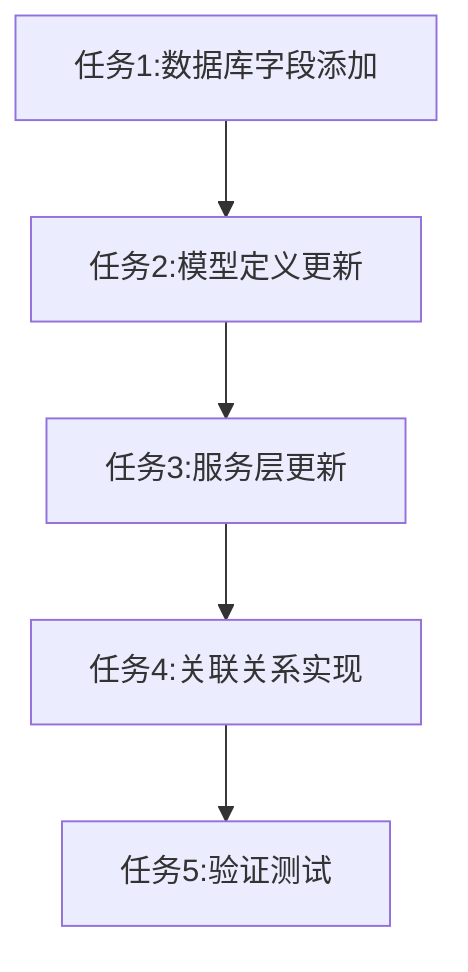

# 衣物保存错误修复任务清单

## 任务总览
修复衣物保存功能因`parent_id`字段缺失导致的错误

## 任务拆分

### 任务1：数据库字段添加
**前置条件**：无
**输入**：当前数据库schema
**输出**：更新后的clothing_items表结构
**实现约束**：
- 使用SQL ALTER TABLE语句
- 字段类型为INT，允许NULL
- 添加外键约束和索引

### 任务2：模型定义更新
**前置条件**：任务1完成
**输入**：ClothingItem.ts模型文件
**输出**：包含parent_id字段的更新模型
**实现约束**：
- 遵循Sequelize装饰器语法
- 添加适当的关联关系
- 保持与现有字段风格一致

### 任务3：服务层更新
**前置条件**：任务2完成
**输入**：ClothingService.ts服务文件
**输出**：支持parent_id参数的服务方法
**实现约束**：
- 更新ClothingCreateData接口
- 在createClothingItem中处理parent_id
- 保持向后兼容性

### 任务4：关联关系实现
**前置条件**：任务3完成
**输入**：ClothingItem模型
**输出**：完整的自引用关联关系
**实现约束**：
- 实现parent/children关联
- 添加级联删除规则
- 避免循环依赖

### 任务5：验证测试
**前置条件**：任务4完成
**输入**：修复后的代码
**输出**：通过所有测试的验证结果
**实现约束**：
- 单元测试覆盖率>90%
- 集成测试覆盖主要场景
- 回归测试确保无破坏

## 任务依赖图

## 验收标准

### 任务1验收
- [ ] clothing_items表包含parent_id字段
- [ ] 外键约束正确设置
- [ ] 索引创建成功

### 任务2验收
- [ ] ClothingItem模型包含parentId属性
- [ ] 装饰器配置正确
- [ ] TypeScript类型定义准确

### 任务3验收
- [ ] ClothingCreateData接口包含parentId
- [ ] createClothingItem正确处理parent_id
- [ ] 空值处理正确

### 任务4验收
- [ ] 自引用关联关系定义
- [ ] 级联规则配置
- [ ] 无循环引用问题

### 任务5验收
- [ ] 单元测试全部通过
- [ ] 集成测试验证保存功能
- [ ] 手动测试无异常