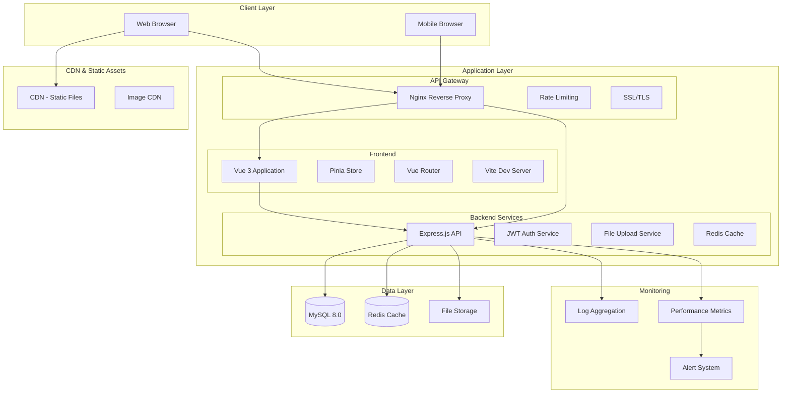
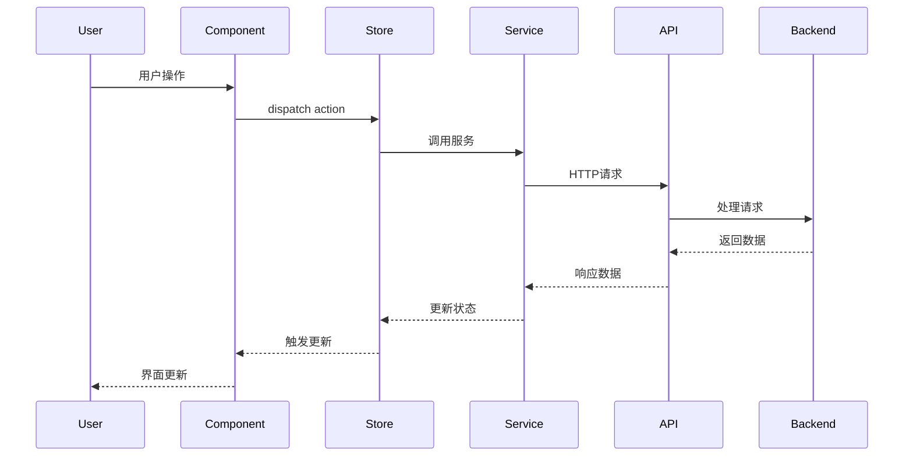
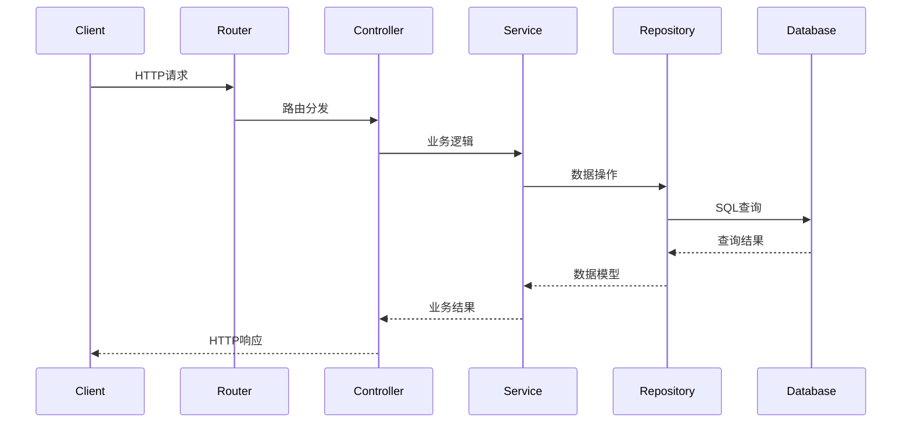
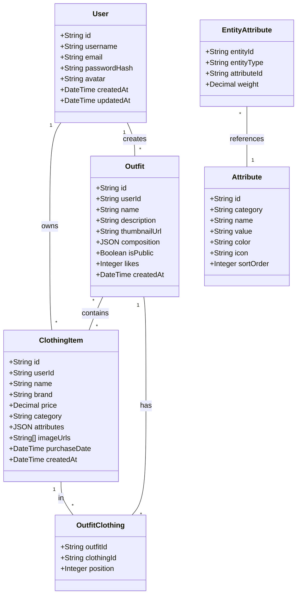

# StyleVault 项目系统性梳理与优化 - 架构设计文档

## 🏗️ 整体架构设计

### 系统架构图



### 分层架构

#### 1. 表示层 (Presentation Layer)
- **技术栈**: Vue 3 + TypeScript + Tailwind CSS
- **职责**: 用户界面、交互逻辑、状态管理
- **组件**: 
  - 页面级组件 (Views)
  - 功能组件 (Features)
  - 通用组件 (Common)
  - 布局组件 (Layout)

#### 2. 应用层 (Application Layer)
- **技术栈**: Express.js + TypeScript
- **职责**: 业务逻辑、API接口、认证授权
- **模块**:
  - 用户管理模块
  - 衣物管理模块
  - 搭配管理模块
  - 文件管理模块

#### 3. 领域层 (Domain Layer)
- **技术栈**: Sequelize ORM + Domain Models
- **职责**: 核心业务规则、数据验证、业务逻辑
- **核心域**:
  - 用户域 (User Aggregate)
  - 衣物域 (Clothing Aggregate)
  - 搭配域 (Outfit Aggregate)

#### 4. 基础设施层 (Infrastructure Layer)
- **技术栈**: MySQL + Redis + Docker
- **职责**: 数据持久化、缓存、文件存储

## 🔄 数据流架构

### 前端数据流



### 后端数据流



## 🗄️ 数据模型架构

### 核心实体关系



### 数据访问层设计

#### Repository模式

```typescript
// 基础Repository接口
interface IRepository<T> {
  findById(id: string): Promise<T | null>
  findAll(filters: any): Promise<T[]>
  create(data: Partial<T>): Promise<T>
  update(id: string, data: Partial<T>): Promise<T>
  delete(id: string): Promise<boolean>
}

// 具体实现
class ClothingItemRepository implements IRepository<ClothingItem> {
  async findById(id: string): Promise<ClothingItem | null> {
    return ClothingItem.findByPk(id, {
      include: [User, Attribute]
    });
  }
  
  async findAll(filters: ClothingFilters): Promise<ClothingItem[]> {
    return ClothingItem.findAll({
      where: this.buildWhereClause(filters),
      include: [User, Attribute],
      order: [['createdAt', 'DESC']],
      limit: filters.limit || 20,
      offset: filters.offset || 0
    });
  }
}
```

## 🔌 API接口设计

### RESTful API规范

#### 资源命名
- **用户**: `/api/v1/users`
- **衣物**: `/api/v1/clothing-items`
- **搭配**: `/api/v1/outfits`
- **图片**: `/api/v1/upload`

#### 响应格式
```typescript
interface ApiResponse<T> {
  success: boolean;
  data?: T;
  error?: {
    code: string;
    message: string;
    details?: any;
  };
  meta?: {
    timestamp: string;
    requestId: string;
    version: string;
  };
}

interface PaginatedResponse<T> extends ApiResponse<T[]> {
  pagination: {
    page: number;
    limit: number;
    total: number;
    totalPages: number;
  };
}
```

### 核心API接口

#### 用户管理
```typescript
// 用户注册
POST /api/v1/auth/register
{
  username: string;
  email: string;
  password: string;
}

// 用户登录
POST /api/v1/auth/login
{
  email: string;
  password: string;
}

// 获取用户信息
GET /api/v1/users/:id

// 更新用户信息
PUT /api/v1/users/:id
{
  username?: string;
  email?: string;
  avatar?: string;
}
```

#### 衣物管理
```typescript
// 获取用户衣物列表
GET /api/v1/clothing-items?userId=123&category=top&limit=20

// 创建衣物
POST /api/v1/clothing-items
{
  name: string;
  brand?: string;
  price?: number;
  category: string;
  attributes: Record<string, any>;
  imageUrls: string[];
}

// 更新衣物
PUT /api/v1/clothing-items/:id

// 删除衣物
DELETE /api/v1/clothing-items/:id
```

#### 搭配管理
```typescript
// 获取搭配列表
GET /api/v1/outfits?userId=123&isPublic=true

// 创建搭配
POST /api/v1/outfits
{
  name: string;
  description?: string;
  clothingItemIds: string[];
  composition: any;
  isPublic?: boolean;
}

// 获取搭配详情
GET /api/v1/outfits/:id

// 更新搭配
PUT /api/v1/outfits/:id

// 删除搭配
DELETE /api/v1/outfits/:id
```

## 🛡️ 安全架构

### 认证授权

#### JWT Token策略
```typescript
interface TokenPayload {
  userId: string;
  username: string;
  email: string;
  iat: number;
  exp: number;
}

// Token配置
const JWT_CONFIG = {
  accessTokenExpiry: '15m',
  refreshTokenExpiry: '7d',
  secret: process.env.JWT_SECRET!,
  algorithm: 'HS256' as const
};
```

#### 权限控制
```typescript
enum UserRole {
  USER = 'user',
  ADMIN = 'admin'
}

interface Permission {
  resource: string;
  actions: string[];
  conditions?: any;
}

// 权限中间件
const authorize = (resource: string, action: string) => {
  return async (req: Request, res: Response, next: NextFunction) => {
    const user = req.user;
    const hasPermission = checkPermission(user, resource, action);
    
    if (!hasPermission) {
      return res.status(403).json({
        success: false,
        error: {
          code: 'FORBIDDEN',
          message: 'Insufficient permissions'
        }
      });
    }
    
    next();
  };
};
```

### 安全措施

#### 1. 输入验证
- **Joi Schema**: 所有API参数验证
- **SQL注入防护**: Sequelize ORM参数化查询
- **XSS防护**: 输出内容转义

#### 2. 文件上传安全
- **文件类型限制**: 仅允许图片格式
- **文件大小限制**: 单文件<5MB
- **病毒扫描**: 集成杀毒引擎
- **存储安全**: 文件重命名、访问控制

#### 3. API安全
- **Rate Limiting**: 基于IP和用户的频率限制
- **CORS配置**: 严格的跨域策略
- **HTTPS强制**: 生产环境强制HTTPS

## 🚀 性能优化架构

### 缓存策略

#### 多层缓存
```typescript
// Redis缓存层
class CacheService {
  async get<T>(key: string): Promise<T | null> {
    const data = await redis.get(key);
    return data ? JSON.parse(data) : null;
  }
  
  async set(key: string, data: any, ttl: number = 3600): Promise<void> {
    await redis.setex(key, ttl, JSON.stringify(data));
  }
  
  async invalidate(pattern: string): Promise<void> {
    const keys = await redis.keys(pattern);
    if (keys.length > 0) {
      await redis.del(...keys);
    }
  }
}

// 缓存策略
const CACHE_STRATEGIES = {
  userProfile: { ttl: 3600, key: 'user:profile:{userId}' },
  clothingList: { ttl: 1800, key: 'clothing:list:{userId}:{filters}' },
  outfitDetail: { ttl: 3600, key: 'outfit:detail:{outfitId}' },
  popularOutfits: { ttl: 900, key: 'outfits:popular' }
};
```

#### 数据库优化
- **索引优化**: 基于查询模式的复合索引
- **查询优化**: 避免N+1查询，使用include关联
- **分页优化**: 游标分页替代OFFSET
- **读写分离**: 读操作使用从库

### 性能监控

#### 监控指标
```typescript
interface PerformanceMetrics {
  api: {
    responseTime: number;
    throughput: number;
    errorRate: number;
  };
  database: {
    queryTime: number;
    connectionPool: number;
    slowQueries: number;
  };
  cache: {
    hitRate: number;
    missRate: number;
    evictionRate: number;
  };
}
```

#### 告警规则
- **响应时间**: P95 > 500ms 告警
- **错误率**: 5分钟错误率 > 1% 告警
- **数据库**: 慢查询 > 1秒 告警
- **缓存**: 命中率 < 80% 告警

## 📦 部署架构

### 容器化部署

#### Docker配置
```dockerfile
# 后端Dockerfile
FROM node:20-alpine AS builder
WORKDIR /app
COPY package*.json ./
RUN npm ci --only=production

FROM node:20-alpine AS runtime
WORKDIR /app
COPY --from=builder /app/node_modules ./node_modules
COPY --from=builder /app/dist ./dist
COPY --from=builder /app/package*.json ./

EXPOSE 3000
CMD ["node", "dist/app.js"]
```

#### Docker Compose配置
```yaml
version: '3.8'
services:
  app:
    build: .
    ports:
      - "3000:3000"
    environment:
      - NODE_ENV=production
    depends_on:
      - mysql
      - redis
    healthcheck:
      test: ["CMD", "curl", "-f", "http://localhost:3000/health"]
      interval: 30s
      timeout: 10s
      retries: 3
      
  mysql:
    image: mysql:8.0
    environment:
      MYSQL_DATABASE: stylevault
      MYSQL_ROOT_PASSWORD: ${DB_PASSWORD}
    volumes:
      - mysql_data:/var/lib/mysql
    ports:
      - "3306:3306"
      
  redis:
    image: redis:7-alpine
    ports:
      - "6379:6379"
    volumes:
      - redis_data:/data

volumes:
  mysql_data:
  redis_data:
```

### 环境配置管理

#### 环境变量
```bash
# .env.production
NODE_ENV=production
PORT=3000
DB_HOST=mysql
DB_PORT=3306
DB_NAME=stylevault
DB_USER=stylevault
DB_PASSWORD=${DB_PASSWORD}
REDIS_HOST=redis
REDIS_PORT=6379
JWT_SECRET=${JWT_SECRET}
UPLOAD_DIR=/app/uploads
```

#### 配置管理
- **开发环境**: `.env.development`
- **测试环境**: `.env.test`
- **预发布**: `.env.staging`
- **生产环境**: `.env.production`

## 🔧 开发工具集成

### 代码质量工具

#### ESLint配置
```javascript
// .eslintrc.js
module.exports = {
  extends: [
    '@typescript-eslint/recommended',
    'prettier'
  ],
  rules: {
    '@typescript-eslint/no-unused-vars': 'error',
    '@typescript-eslint/explicit-function-return-type': 'warn',
    'no-console': process.env.NODE_ENV === 'production' ? 'error' : 'warn'
  }
};
```

#### Prettier配置
```javascript
// .prettierrc.js
module.exports = {
  semi: true,
  trailingComma: 'es5',
  singleQuote: true,
  printWidth: 80,
  tabWidth: 2
};
```

### Git工作流

#### 分支策略
```bash
main           # 生产分支
develop        # 开发分支
feature/*      # 功能分支
hotfix/*       # 紧急修复
release/*      # 发布分支
```

#### 提交规范
```bash
feat: add new clothing management API
fix: resolve user authentication issue
docs: update API documentation
style: format code with prettier
refactor: improve database query performance
test: add unit tests for user service
chore: update dependencies
```

## 📊 监控和可观测性

### 日志架构

#### 日志格式
```typescript
interface LogEntry {
  timestamp: string;
  level: 'error' | 'warn' | 'info' | 'debug';
  message: string;
  context: {
    requestId: string;
    userId?: string;
    ip: string;
    userAgent: string;
  };
  metadata?: any;
}
```

#### 日志收集
- **应用日志**: Winston + Daily Rotate File
- **访问日志**: Morgan + Apache格式
- **错误日志**: 集中错误收集和告警
- **性能日志**: 响应时间、数据库查询时间

### 监控仪表板

#### Grafana仪表板
- **系统监控**: CPU、内存、磁盘、网络
- **应用监控**: API响应时间、错误率、吞吐量
- **业务监控**: 用户注册、衣物创建、搭配分享
- **数据库监控**: 查询性能、连接池、慢查询

#### 告警配置
- **Slack集成**: 实时告警通知
- **邮件通知**: 关键错误邮件告警
- **PagerDuty**: 生产环境紧急告警
- **自定义Webhook**: 集成第三方系统