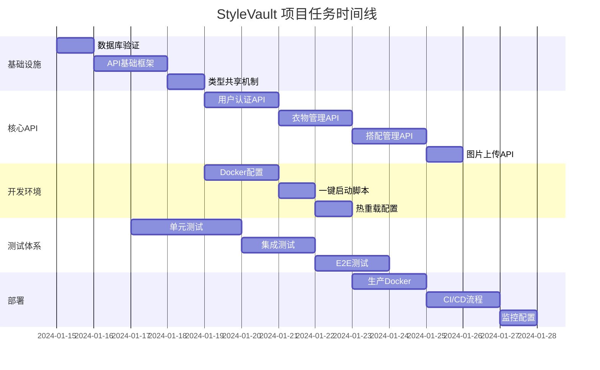
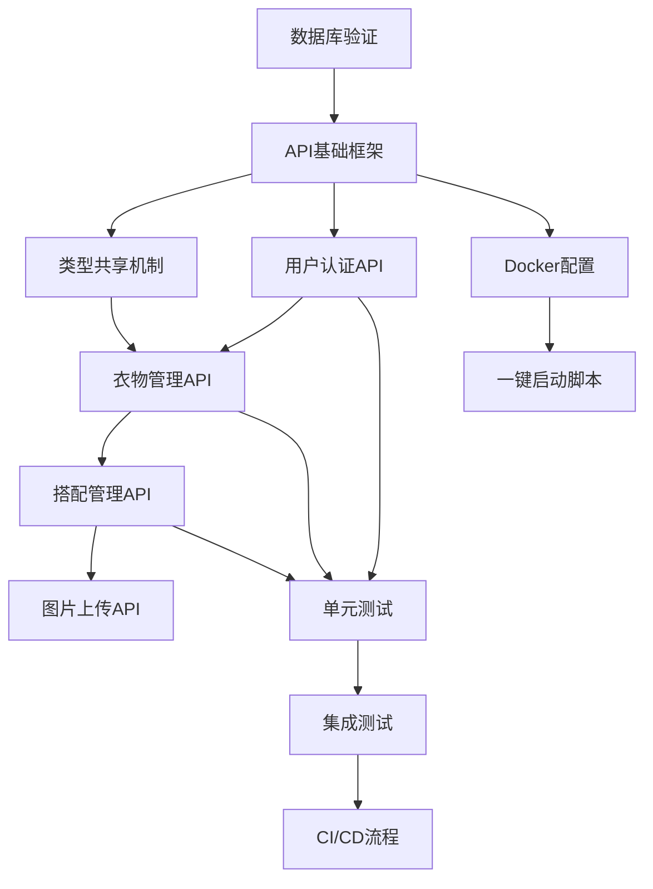

# StyleVault 项目系统性梳理与优化 - 原子任务清单

## 🎯 任务总览

项目被拆分为 **20个原子任务**，每个任务独立可执行，有明确的输入输出和验收标准。



## 📋 原子任务清单

### 🔧 基础设施任务 (5个)

#### 任务1: 数据库验证与初始化
**任务ID**: INFRA-001
**优先级**: 🔴 高
**预计工时**: 0.5天
**前置依赖**: 无

**输入契约**:
- MySQL 8.0+ 已安装运行
- `.env` 文件已配置
- Sequelize模型文件已存在

**输出契约**:
- 所有10个数据表成功创建
- 外键约束正确建立
- 索引创建完成
- 验证报告文档

**实现步骤**:
1. 运行数据库连接测试
2. 执行模型同步脚本
3. 验证表结构和约束
4. 创建测试数据
5. 生成验证报告

**验收标准**:
```bash
# 验证命令
npm run db:test
npm run validate-models
# 预期结果: 所有检查通过
```

#### 任务2: API基础框架搭建
**任务ID**: INFRA-002
**优先级**: 🔴 高
**预计工时**: 1天
**前置依赖**: INFRA-001

**输入契约**:
- Express.js已安装
- 基础中间件配置
- 错误处理机制设计

**输出契约**:
- 统一的API响应格式
- 全局错误处理中间件
- 请求日志记录
- 健康检查接口

**核心代码**:
```typescript
// src/middleware/errorHandler.ts
export const errorHandler = (
  error: Error,
  req: Request,
  res: Response,
  next: NextFunction
) => {
  const statusCode = error.statusCode || 500;
  const message = error.message || 'Internal Server Error';
  
  logger.error('API Error', {
    error: error.message,
    stack: error.stack,
    url: req.url,
    method: req.method,
    ip: req.ip
  });
  
  res.status(statusCode).json({
    success: false,
    error: {
      code: error.name || 'INTERNAL_ERROR',
      message,
      ...(process.env.NODE_ENV === 'development' && { stack: error.stack })
    }
  });
};
```

#### 任务3: 类型共享机制
**任务ID**: INFRA-003
**优先级**: 🟡 中
**预计工时**: 0.5天
**前置依赖**: INFRA-002

**输入契约**:
- 前后端TypeScript配置
- 模型定义文件

**输出契约**:
- 共享类型定义包
- 自动生成脚本
- 类型检查配置

**实现方案**:
```typescript
// shared/types/api.ts
export interface ApiResponse<T = any> {
  success: boolean;
  data?: T;
  error?: ApiError;
  meta?: ApiMeta;
}

export interface PaginatedResponse<T> extends ApiResponse<T[]> {
  pagination: {
    page: number;
    limit: number;
    total: number;
    totalPages: number;
  };
}
```

#### 任务4: 环境配置管理
**任务ID**: INFRA-004
**优先级**: 🟡 中
**预计工时**: 0.5天
**前置依赖**: INFRA-002

**输入契约**:
- 环境变量模板
- 配置验证规则

**输出契约**:
- 多环境配置文件
- 配置验证脚本
- 环境检查工具

**配置文件**:
```bash
# .env.development
NODE_ENV=development
PORT=3000
DB_HOST=localhost
DB_PORT=3306
DB_NAME=stylevault_dev
DB_USER=root
DB_PASSWORD=password
JWT_SECRET=dev-secret-key
```

#### 任务5: 日志系统配置
**任务ID**: INFRA-005
**优先级**: 🟢 低
**预计工时**: 0.5天
**前置依赖**: INFRA-002

**输入契约**:
- Winston日志库
- 日志格式设计

**输出契约**:
- 结构化日志配置
- 日志轮转设置
- 错误追踪集成

### 👤 用户认证任务 (3个)

#### 任务6: 用户注册API
**任务ID**: AUTH-001
**优先级**: 🔴 高
**预计工时**: 1天
**前置依赖**: INFRA-002

**输入契约**:
- 用户模型定义
- 密码加密方案
- 邮箱验证规则

**输出契约**:
- POST /api/v1/auth/register
- 输入验证
- 密码加密存储
- JWT Token生成

**API实现**:
```typescript
// src/controllers/authController.ts
export const register = async (req: Request, res: Response) => {
  const { username, email, password } = req.body;
  
  // 验证输入
  const { error } = registerSchema.validate(req.body);
  if (error) {
    throw new ValidationError(error.details[0].message);
  }
  
  // 检查用户存在
  const existingUser = await User.findOne({
    where: { [Op.or]: [{ email }, { username }] }
  });
  
  if (existingUser) {
    throw new ConflictError('User already exists');
  }
  
  // 创建用户
  const hashedPassword = await bcrypt.hash(password, 12);
  const user = await User.create({
    username,
    email,
    password: hashedPassword
  });
  
  // 生成Token
  const token = generateToken(user);
  
  res.status(201).json({
    success: true,
    data: {
      user: sanitizeUser(user),
      token
    }
  });
};
```

#### 任务7: 用户登录API
**任务ID**: AUTH-002
**优先级**: 🔴 高
**预计工时**: 0.5天
**前置依赖**: AUTH-001

**输入契约**:
- 用户认证逻辑
- JWT配置
- Refresh Token机制

**输出契约**:
- POST /api/v1/auth/login
- Token刷新接口
- 登录验证中间件

#### 任务8: 用户资料管理
**任务ID**: AUTH-003
**优先级**: 🟡 中
**预计工时**: 0.5天
**前置依赖**: AUTH-001

**输入契约**:
- 用户信息模型
- 头像上传功能
- 权限验证

**输出契约**:
- GET /api/v1/users/:id
- PUT /api/v1/users/:id
- DELETE /api/v1/users/:id

### 👕 衣物管理任务 (3个)

#### 任务9: 衣物CRUD API
**任务ID**: CLOTHING-001
**优先级**: 🔴 高
**预计工时**: 1.5天
**前置依赖**: INFRA-001, AUTH-001

**输入契约**:
- 衣物数据模型
- 图片上传功能
- 分类和标签系统

**输出契约**:
- GET /api/v1/clothing-items
- POST /api/v1/clothing-items
- PUT /api/v1/clothing-items/:id
- DELETE /api/v1/clothing-items/:id

**实现功能**:
- 分页查询
- 多条件筛选
- 图片上传处理
- 属性关联管理

#### 任务10: 衣物搜索API
**任务ID**: CLOTHING-002
**优先级**: 🟡 中
**预计工时**: 1天
**前置依赖**: CLOTHING-001

**输入契约**:
- 搜索参数设计
- 全文索引配置
- 排序和过滤规则

**输出契约**:
- GET /api/v1/clothing-items/search
- 支持模糊搜索
- 多维度筛选
- 智能推荐

#### 任务11: 衣物统计API
**任务ID**: CLOTHING-003
**优先级**: 🟢 低
**预计工时**: 0.5天
**前置依赖**: CLOTHING-001

**输入契约**:
- 统计数据需求
- 聚合查询设计
- 缓存策略

**输出契约**:
- GET /api/v1/clothing-items/stats
- 用户衣物统计
- 分类分布数据
- 使用频率分析

### 👗 搭配管理任务 (3个)

#### 任务12: 搭配CRUD API
**任务ID**: OUTFIT-001
**优先级**: 🔴 高
**预计工时**: 1.5天
**前置依赖**: CLOTHING-001

**输入契约**:
- 搭配数据模型
- 衣物关联关系
- 组合验证规则

**输出契约**:
- GET /api/v1/outfits
- POST /api/v1/outfits
- PUT /api/v1/outfits/:id
- DELETE /api/v1/outfits/:id

#### 任务13: 搭配分享功能
**任务ID**: OUTFIT-002
**优先级**: 🟡 中
**预计工时**: 1天
**前置依赖**: OUTFIT-001

**输入契约**:
- 分享权限控制
- 公开/私有设置
- 社交功能基础

**输出契约**:
- POST /api/v1/outfits/:id/share
- PUT /api/v1/outfits/:id/visibility
- GET /api/v1/outfits/public

#### 任务14: 搭配推荐API
**任务ID**: OUTFIT-003
**优先级**: 🟢 低
**预计工时**: 1天
**前置依赖**: OUTFIT-001

**输入契约**:
- 推荐算法设计
- 用户偏好数据
- 机器学习模型

**输出契约**:
- GET /api/v1/outfits/recommendations
- 基于天气推荐
- 基于历史偏好
- 热门搭配推荐

### 📸 文件上传任务 (2个)

#### 任务15: 图片上传API
**任务ID**: UPLOAD-001
**优先级**: 🔴 高
**预计工时**: 1天
**前置依赖**: INFRA-002

**输入契约**:
- Multer配置
- Sharp图片处理
- 存储策略选择

**输出契约**:
- POST /api/v1/upload/image
- 图片压缩处理
- 多尺寸生成
- CDN集成准备

#### 任务16: 文件管理API
**任务ID**: UPLOAD-002
**优先级**: 🟡 中
**预计工时**: 0.5天
**前置依赖**: UPLOAD-001

**输入契约**:
- 文件存储管理
- 访问权限控制
- 清理策略

**输出契约**:
- GET /api/v1/upload/files
- DELETE /api/v1/upload/files/:id
- 文件元数据管理

### 🐳 容器化任务 (4个)

#### 任务17: 后端Docker配置
**任务ID**: DOCKER-001
**优先级**: 🟡 中
**预计工时**: 0.5天
**前置依赖**: INFRA-005

**输入契约**:
- Node.js应用结构
- 依赖管理
- 环境变量配置

**输出契约**:
- Dockerfile (多阶段构建)
- .dockerignore
- 构建脚本

**Dockerfile示例**:
```dockerfile
FROM node:20-alpine AS builder
WORKDIR /app
COPY package*.json ./
RUN npm ci --only=production

FROM node:20-alpine AS runtime
WORKDIR /app
COPY --from=builder /app .
COPY . .
EXPOSE 3000
CMD ["node", "dist/app.js"]
```

#### 任务18: 前端Docker配置
**任务ID**: DOCKER-002
**优先级**: 🟡 中
**预计工时**: 0.5天
**前置依赖**: DOCKER-001

**输入契约**:
- Vite构建配置
- 静态文件服务
- 环境变量注入

**输出契约**:
- 前端Dockerfile
- Nginx配置
- 构建优化

#### 任务19: Docker Compose配置
**任务ID**: DOCKER-003
**优先级**: 🔴 高
**预计工时**: 1天
**前置依赖**: DOCKER-001, DOCKER-002

**输入契约**:
- 服务依赖关系
- 网络配置
- 数据卷管理

**输出契约**:
- docker-compose.yml
- 开发环境配置
- 生产环境配置

#### 任务20: 一键启动脚本
**任务ID**: DOCKER-004
**优先级**: 🔴 高
**预计工时**: 0.5天
**前置依赖**: DOCKER-003

**输入契约**:
- 跨平台脚本需求
- 环境检测逻辑
- 错误处理机制

**输出契约**:
- scripts/dev-start.sh
- scripts/dev-stop.sh
- scripts/dev-restart.sh

**脚本示例**:
```bash
#!/bin/bash
# scripts/dev-start.sh

echo "🚀 Starting StyleVault development environment..."

# 检查Docker
if ! command -v docker &> /dev/null; then
    echo "❌ Docker is not installed"
    exit 1
fi

# 检查环境文件
if [ ! -f .env ]; then
    cp .env.example .env
    echo "⚠️  Created .env file from template"
fi

# 启动服务
docker-compose -f docker-compose.dev.yml up -d

echo "✅ Development environment started!"
echo "Frontend: http://localhost:5173"
echo "Backend: http://localhost:3000"
echo "Database: localhost:3306"
```

## 🎯 任务依赖图



## 📊 任务优先级矩阵

| 优先级 | 任务数量 | 预计工期 | 关键路径 |
|--------|----------|----------|----------|
| 🔴 高 | 8个 | 8天 | 核心功能 |
| 🟡 中 | 7个 | 6天 | 增强功能 |
| 🟢 低 | 5个 | 3天 | 优化功能 |

## 🏃‍♂️ 执行建议

### 第一周执行计划
1. **Day 1**: 任务1-3 (基础设施)
2. **Day 2-3**: 任务6-8 (用户认证)
3. **Day 4-5**: 任务9-11 (衣物管理)
4. **Weekend**: 任务17-20 (容器化)

### 第二周执行计划
1. **Day 1-2**: 任务12-14 (搭配管理)
2. **Day 3**: 任务15-16 (文件上传)
3. **Day 4-5**: 任务4-5, 任务19-20 (优化和部署)

## ✅ 任务完成检查表

### 每日检查
- [ ] 代码提交到Git
- [ ] 单元测试通过
- [ ] 文档同步更新
- [ ] 任务状态更新

### 每周检查
- [ ] 集成测试通过
- [ ] 代码审查完成
- [ ] 部署验证成功
- [ ] 性能测试通过