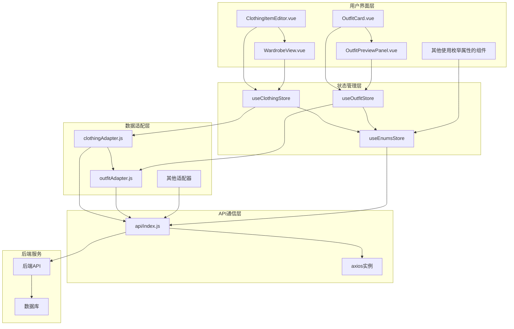
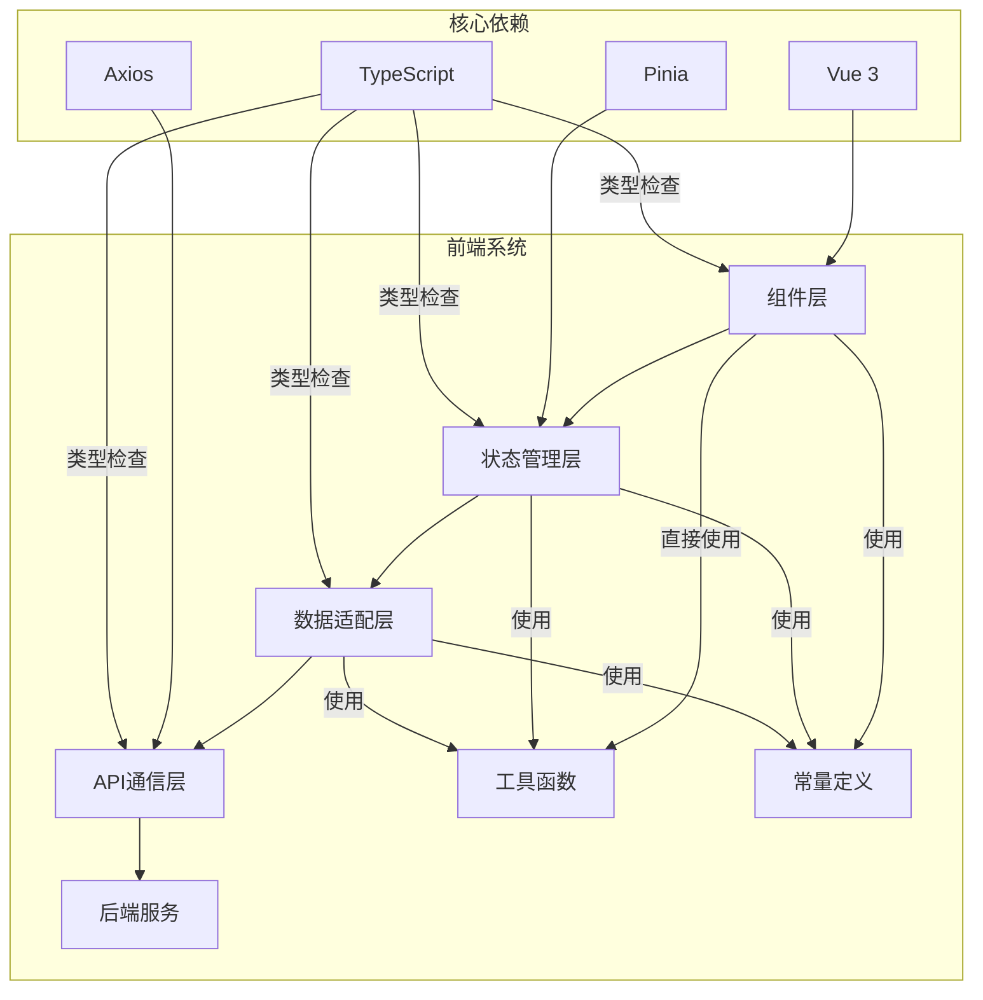
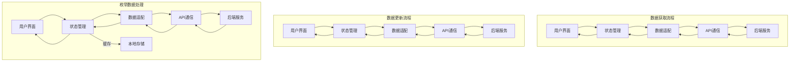

# DESIGN: 前端系统配套改造

## 1. 整体架构设计

### 1.1 系统架构图

### 1.2 架构说明

本次改造采用分层架构设计，确保系统的可维护性、可扩展性和性能优化：

1. **用户界面层**: 包含所有与用户交互的组件，负责数据展示和用户输入
2. **状态管理层**: 使用Pinia管理应用状态，包括衣物数据、枚举数据等
3. **数据适配层**: 负责前后端数据格式的转换和适配
4. **API通信层**: 封装axios实例，处理HTTP请求和响应
5. **后端服务**: 提供API接口和数据存储

## 2. 分层设计和核心组件

### 2.1 用户界面层

**核心组件**: 
- **ClothingItemEditor.vue**: 衣物编辑组件，负责衣物信息的输入和编辑
- **WardrobeView.vue**: 衣橱页面组件，负责衣物列表的展示和管理
- **OutfitCard.vue**: 搭配卡片组件，负责搭配信息的展示
- **OutfitPreviewPanel.vue**: 搭配预览面板组件，负责搭配详情的展示
- **其他使用枚举属性的组件**: 包括所有涉及季节、材质、图案、尺码等枚举属性的组件

**改造要点**: 
- 更新组件的模板和脚本，支持使用枚举ID而非字符串值
- 确保所有枚举属性在UI上显示正确的文本
- 优化用户体验，保持操作习惯的一致性

### 2.2 状态管理层

**核心组件**: 
- **useClothingStore**: 衣物状态管理，负责衣物数据的获取、更新和存储
- **useOutfitStore**: 搭配状态管理，负责搭配数据的获取、更新和存储
- **useEnumsStore**: 枚举状态管理，负责枚举数据的获取、缓存和映射

**改造要点**: 
- 增强useEnumsStore，提供完整的枚举数据管理功能
- 更新useClothingStore和useOutfitStore，确保与新的数据格式兼容
- 实现枚举数据的缓存和更新机制

### 2.3 数据适配层

**核心组件**: 
- **clothingAdapter.js**: 衣物数据适配器，负责衣物数据格式的转换
- **outfitAdapter.js**: 搭配数据适配器，负责搭配数据格式的转换
- **其他适配器**: 包括analyticsAdapter.js等其他模块的适配器

**改造要点**: 
- 更新适配器，实现ID与显示文本的双向映射
- 确保数据格式的一致性和兼容性
- 优化数据处理逻辑，提高系统性能

### 2.4 API通信层

**核心组件**: 
- **api/index.js**: 封装axios实例，处理HTTP请求和响应
- **clothingApi.js**: 衣物API封装
- **outfitApi.js**: 搭配API封装
- **analyticsApi.js**: 分析API封装

**改造要点**: 
- 确保API调用与新的数据格式兼容
- 优化请求和响应处理
- 实现错误处理和重试机制

## 3. 模块依赖关系图

## 4. 接口契约定义

### 4.1 前端组件接口

**ClothingItemEditor.vue**: 
- **Props**: isOpen(Boolean), item(Object), readOnly(Boolean)
- **Emits**: close(), saved()
- **核心方法**: saveItem(), handleImageUpload(), updateCategoryName()

**WardrobeView.vue**: 
- **核心方法**: fetchClothingItems(), filterItems(), sortItems()
- **计算属性**: filteredAndSortedItems, groupedItems

**useEnumsStore**: 
- **State**: seasons(Array), materials(Array), patterns(Array), sizes(Array), loading(Boolean)
- **Actions**: fetchAllEnums()
- **Getters**: getSeasonLabel, getSeasonId, getMaterialLabel, getMaterialId, getPatternLabel, getPatternId, getSizeLabel, getSizeId

### 4.2 数据适配层接口

**clothingAdapter.js**: 
- **fetchClothingItems(params)**: 获取衣物列表，返回Promise
- **getClothingItem(id)**: 获取单个衣物，返回Promise
- **addClothingItem(data)**: 添加新衣物，返回Promise
- **updateClothingItem(id, data)**: 更新衣物，返回Promise
- **deleteClothingItem(id)**: 删除衣物，返回Promise

**outfitAdapter.js**: 
- **fetchOutfits(params)**: 获取搭配列表，返回Promise
- **getOutfit(id)**: 获取单个搭配，返回Promise
- **addOutfit(data)**: 添加新搭配，返回Promise
- **updateOutfit(id, data)**: 更新搭配，返回Promise
- **deleteOutfit(id)**: 删除搭配，返回Promise

### 4.3 API接口

**枚举API**: 
- **GET /api/enums/seasons**: 获取季节枚举数据
- **GET /api/enums/materials**: 获取材质枚举数据
- **GET /api/enums/patterns**: 获取图案枚举数据
- **GET /api/enums/sizes**: 获取尺码枚举数据

**衣物API**: 
- **GET /api/clothing**: 获取衣物列表
- **GET /api/clothing/:id**: 获取单个衣物
- **POST /api/clothing**: 添加新衣物
- **PUT /api/clothing/:id**: 更新衣物
- **DELETE /api/clothing/:id**: 删除衣物

**搭配API**: 
- **GET /api/outfits**: 获取搭配列表
- **GET /api/outfits/:id**: 获取单个搭配
- **POST /api/outfits**: 添加新搭配
- **PUT /api/outfits/:id**: 更新搭配
- **DELETE /api/outfits/:id**: 删除搭配

## 5. 数据流向图

### 5.1 数据获取流程

1. 用户界面发起数据获取请求
2. 状态管理调用数据适配层方法
3. 数据适配层调用API通信层发送请求
4. 后端服务返回数据
5. API通信层接收响应
6. 数据适配层转换数据格式（将ID转换为显示文本）
7. 状态管理更新状态
8. 用户界面更新展示

### 5.2 数据更新流程

1. 用户界面输入数据并提交
2. 状态管理调用数据适配层方法
3. 数据适配层转换数据格式（将显示文本转换为ID）
4. 数据适配层调用API通信层发送请求
5. 后端服务处理请求并返回结果
6. API通信层接收响应
7. 状态管理更新状态
8. 用户界面更新展示

### 5.3 枚举数据处理

1. 应用启动时，状态管理加载枚举数据
2. 枚举数据从后端获取并缓存到本地
3. 状态管理提供枚举数据的映射方法
4. 其他组件通过状态管理获取枚举数据和映射方法
5. 实现枚举数据的缓存失效和刷新机制

## 6. 异常处理策略

### 6.1 数据转换错误处理

1. **防御性编程**: 在数据转换过程中添加类型检查和空值处理
2. **错误日志**: 记录详细的错误日志，便于问题排查
3. **默认值处理**: 为缺失或无效的枚举值提供合理的默认值
4. **用户反馈**: 通过toast提示用户操作结果和可能的错误

### 6.2 网络请求错误处理

1. **重试机制**: 对临时网络错误实现自动重试机制
2. **超时处理**: 设置合理的请求超时时间
3. **错误提示**: 根据错误类型提供友好的用户提示
4. **离线支持**: 在离线状态下提供有限的功能支持

### 6.3 数据兼容处理

1. **版本检测**: 检测后端API版本，确保兼容性
2. **数据迁移**: 对旧版本数据进行自动转换
3. **回滚机制**: 在出现严重问题时能够回滚到之前的版本
4. **平滑过渡**: 实现新旧数据格式的平滑过渡，确保用户体验不受影响

## 7. 设计原则

### 7.1 严格按照任务范围

- 聚焦于数据库架构改造的前端配套改造
- 不引入与改造无关的新功能
- 确保改造的最小化和精确性

### 7.2 确保与现有系统架构一致

- 遵循现有的分层架构设计
- 保持组件化和模块化的设计思想
- 复用现有的工具和库

### 7.3 复用现有组件和模式

- 复用现有的adapter模式
- 复用现有的状态管理模式
- 复用现有的组件通信模式

通过以上设计，我们确保了前端系统配套改造的系统性、完整性和可实施性，为后续的原子化拆分和实现提供了清晰的指导。