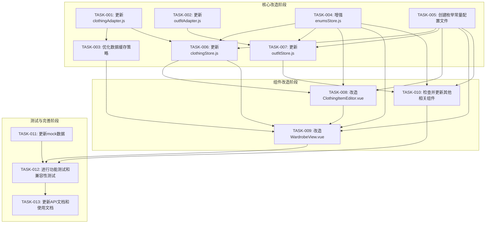

# TASK: 前端系统配套改造

## 1. 子任务拆分

### 1.1 数据适配层改造

#### TASK-001: 更新clothingAdapter.js

**输入契约**: 
- 前置依赖: 了解数据库字段类型变更
- 输入数据: 后端返回的新数据格式（枚举属性为ID）
- 环境依赖: axios、useEnumsStore

**输出契约**: 
- 输出数据: 转换后的数据（枚举属性为显示文本）
- 交付物: 更新后的clothingAdapter.js文件
- 验收标准: 能够正确将后端返回的ID转换为显示文本，将前端的显示文本转换为ID

**实现约束**: 
- 技术栈: JavaScript/TypeScript
- 接口规范: 保持现有API接口不变
- 质量要求: 代码通过ESLint检查，添加必要的注释

**依赖关系**: 
- 后置任务: TASK-003、TASK-007
- 并行任务: TASK-002

#### TASK-002: 更新outfitAdapter.js

**输入契约**: 
- 前置依赖: 了解数据库字段重命名和类型变更
- 输入数据: 后端返回的新数据格式（style_id重命名为style）
- 环境依赖: axios、useEnumsStore

**输出契约**: 
- 输出数据: 适配后的数据
- 交付物: 更新后的outfitAdapter.js文件
- 验收标准: 能够正确处理style字段的重命名和类型变更

**实现约束**: 
- 技术栈: JavaScript/TypeScript
- 接口规范: 保持现有API接口不变
- 质量要求: 代码通过ESLint检查，添加必要的注释

**依赖关系**: 
- 后置任务: TASK-008
- 并行任务: TASK-001

#### TASK-003: 优化数据缓存策略

**输入契约**: 
- 前置依赖: TASK-001完成
- 输入数据: PerformanceMonitor、CacheManager类
- 环境依赖: 浏览器localStorage

**输出契约**: 
- 输出数据: 缓存的枚举数据
- 交付物: 优化后的缓存策略实现
- 验收标准: 枚举数据能够被有效缓存，减少网络请求

**实现约束**: 
- 技术栈: JavaScript/TypeScript
- 接口规范: 遵循现有缓存接口
- 质量要求: 代码通过ESLint检查，添加必要的注释

**依赖关系**: 
- 前置任务: TASK-001
- 后置任务: TASK-007
- 并行任务: TASK-004

### 1.2 枚举管理模块增强

#### TASK-004: 增强enumsStore.js

**输入契约**: 
- 前置依赖: 了解枚举数据结构和API
- 输入数据: 后端返回的枚举数据
- 环境依赖: Pinia、axios

**输出契约**: 
- 输出数据: 增强的枚举状态管理实例
- 交付物: 更新后的enumsStore.js文件
- 验收标准: 能够正确获取、缓存和映射枚举数据

**实现约束**: 
- 技术栈: JavaScript/TypeScript、Pinia
- 接口规范: 保持现有接口不变，扩展新功能
- 质量要求: 代码通过ESLint检查，添加必要的注释

**依赖关系**: 
- 后置任务: TASK-007、TASK-008
- 并行任务: TASK-003

#### TASK-005: 创建枚举常量配置文件

**输入契约**: 
- 前置依赖: 了解所有枚举属性的配置信息
- 输入数据: 枚举属性的定义和验证规则
- 环境依赖: 无

**输出契约**: 
- 输出数据: 枚举常量配置对象
- 交付物: enumConstants.js文件
- 验收标准: 集中管理所有枚举属性的配置信息

**实现约束**: 
- 技术栈: JavaScript/TypeScript
- 接口规范: 提供清晰的常量定义和配置结构
- 质量要求: 代码通过ESLint检查，添加必要的注释

**依赖关系**: 
- 后置任务: TASK-007、TASK-008
- 并行任务: TASK-006

### 1.3 状态管理更新

#### TASK-006: 更新clothingStore.js

**输入契约**: 
- 前置依赖: TASK-001完成
- 输入数据: 新的数据格式和枚举处理逻辑
- 环境依赖: Pinia、clothingAdapter

**输出契约**: 
- 输出数据: 更新后的衣物状态管理实例
- 交付物: 更新后的clothingStore.js文件
- 验收标准: 能够正确管理新的数据格式

**实现约束**: 
- 技术栈: JavaScript/TypeScript、Pinia
- 接口规范: 保持现有接口不变
- 质量要求: 代码通过ESLint检查，添加必要的注释

**依赖关系**: 
- 前置任务: TASK-001
- 后置任务: TASK-007
- 并行任务: TASK-005

#### TASK-007: 更新outfitStore.js

**输入契约**: 
- 前置依赖: TASK-002完成
- 输入数据: 新的数据格式和枚举处理逻辑
- 环境依赖: Pinia、outfitAdapter

**输出契约**: 
- 输出数据: 更新后的搭配状态管理实例
- 交付物: 更新后的outfitStore.js文件
- 验收标准: 能够正确管理新的数据格式

**实现约束**: 
- 技术栈: JavaScript/TypeScript、Pinia
- 接口规范: 保持现有接口不变
- 质量要求: 代码通过ESLint检查，添加必要的注释

**依赖关系**: 
- 前置任务: TASK-002
- 后置任务: TASK-008
- 并行任务: TASK-006

### 1.4 组件改造

#### TASK-008: 改造ClothingItemEditor.vue

**输入契约**: 
- 前置依赖: TASK-004、TASK-005、TASK-006完成
- 输入数据: 新的表单数据结构和枚举处理逻辑
- 环境依赖: Vue 3、useClothingStore、useEnumsStore

**输出契约**: 
- 输出数据: 改造后的衣物编辑组件
- 交付物: 更新后的ClothingItemEditor.vue文件
- 验收标准: 能够正确处理枚举ID，表单提交正常

**实现约束**: 
- 技术栈: Vue 3、JavaScript/TypeScript
- 接口规范: 保持现有props和emits不变
- 质量要求: 代码通过ESLint检查，保持用户体验一致

**依赖关系**: 
- 前置任务: TASK-004、TASK-005、TASK-006
- 后置任务: TASK-009
- 并行任务: TASK-010

#### TASK-009: 改造WardrobeView.vue

**输入契约**: 
- 前置依赖: TASK-004、TASK-005、TASK-006完成
- 输入数据: 新的数据格式和枚举处理逻辑
- 环境依赖: Vue 3、useClothingStore、useEnumsStore

**输出契约**: 
- 输出数据: 改造后的衣橱页面组件
- 交付物: 更新后的WardrobeView.vue文件
- 验收标准: 能够正确展示枚举文本，筛选排序正常

**实现约束**: 
- 技术栈: Vue 3、JavaScript/TypeScript
- 接口规范: 保持现有功能不变
- 质量要求: 代码通过ESLint检查，保持用户体验一致

**依赖关系**: 
- 前置任务: TASK-004、TASK-005、TASK-006、TASK-008
- 并行任务: TASK-010

#### TASK-010: 检查并更新其他相关组件

**输入契约**: 
- 前置依赖: TASK-004、TASK-005、TASK-007完成
- 输入数据: 所有使用枚举属性的组件列表
- 环境依赖: Vue 3、useEnumsStore

**输出契约**: 
- 输出数据: 改造后的组件
- 交付物: 更新后的各个组件文件
- 验收标准: 所有组件都能正确处理枚举属性

**实现约束**: 
- 技术栈: Vue 3、JavaScript/TypeScript
- 接口规范: 保持现有功能不变
- 质量要求: 代码通过ESLint检查，保持用户体验一致

**依赖关系**: 
- 前置任务: TASK-004、TASK-005、TASK-007
- 并行任务: TASK-008、TASK-009

### 1.5 模拟数据更新

#### TASK-011: 更新mock数据

**输入契约**: 
- 前置依赖: 了解新的数据格式
- 输入数据: 现有的mock数据文件
- 环境依赖: 无

**输出契约**: 
- 输出数据: 更新后的模拟数据
- 交付物: 更新后的mock/data.js和mock/outfit.js文件
- 验收标准: 模拟数据与新的字段类型一致

**实现约束**: 
- 技术栈: JavaScript/TypeScript
- 接口规范: 保持现有数据结构不变，只更新字段类型
- 质量要求: 代码通过ESLint检查

**依赖关系**: 
- 后置任务: TASK-012
- 并行任务: TASK-012

### 1.6 测试与验证

#### TASK-012: 进行功能测试和兼容性测试

**输入契约**: 
- 前置依赖: TASK-001到TASK-011完成
- 输入数据: 测试用例和测试环境
- 环境依赖: 浏览器、测试工具

**输出契约**: 
- 输出数据: 测试报告
- 交付物: 测试记录和问题清单
- 验收标准: 所有测试用例通过，问题得到解决

**实现约束**: 
- 技术栈: 测试工具
- 接口规范: 遵循测试流程
- 质量要求: 测试覆盖率达到80%以上

**依赖关系**: 
- 前置任务: TASK-001到TASK-011
- 并行任务: TASK-011

### 1.7 文档完善

#### TASK-013: 更新API文档和使用文档

**输入契约**: 
- 前置依赖: TASK-001到TASK-012完成
- 输入数据: 现有的文档
- 环境依赖: 文档工具

**输出契约**: 
- 输出数据: 更新后的文档
- 交付物: 技术文档、API文档、使用文档
- 验收标准: 文档内容准确、完整、清晰

**实现约束**: 
- 技术栈: Markdown
- 接口规范: 遵循文档格式要求
- 质量要求: 文档结构清晰，内容详实

**依赖关系**: 
- 前置任务: TASK-001到TASK-012

## 2. 任务依赖图

## 3. 拆分原则

1. **复杂度可控**: 每个任务的复杂度适中，便于高成功率交付
2. **功能模块分解**: 按功能模块分解任务，确保任务原子性和独立性
3. **明确的验收标准**: 每个任务都有明确的验收标准，便于独立验证
4. **依赖关系清晰**: 任务之间的依赖关系明确，避免循环依赖

## 4. 执行检查清单

### 4.1 完整性检查
- [ ] 任务计划覆盖所有需求
- [ ] 每个任务都有明确的输入输出契约
- [ ] 每个任务都有明确的实现约束和依赖关系

### 4.2 一致性检查
- [ ] 与前期文档（ALIGNMENT、CONSENSUS、DESIGN）保持一致
- [ ] 任务描述与技术方案一致
- [ ] 依赖关系与架构设计一致

### 4.3 可行性检查
- [ ] 技术方案确实可行
- [ ] 资源和时间安排合理
- [ ] 风险在可接受范围

### 4.4 可控性检查
- [ ] 每个任务的复杂度可控
- [ ] 每个任务都可以独立验证
- [ ] 有明确的进度跟踪机制

### 4.5 可测性检查
- [ ] 每个任务都有明确的验收标准
- [ ] 验收标准可执行、可量化
- [ ] 有完善的测试计划

通过以上任务拆分和规划，我们确保了前端系统配套改造的可执行性和可控性，为后续的实施和验收提供了清晰的指导。