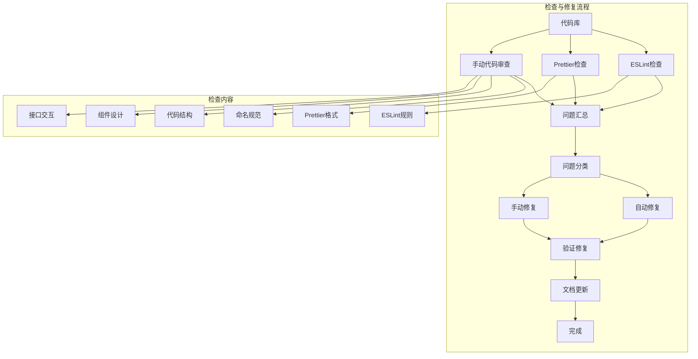

# 前端代码规范检查 - 设计文档

## 1. 整体架构

StyleVault前端项目采用了标准的Vue 3应用架构，遵循组件化、模块化的设计理念。代码规范检查将基于这个架构展开，确保每个模块和组件都符合项目制定的规范。



## 2. 模块设计

### 2.1 检查模块

**功能**：对代码库进行全面的规范符合性检查

**子模块**：
- **ESLint检查器**：负责检查代码是否符合ESLint规则
- **Prettier检查器**：负责检查代码格式是否符合Prettier规范
- **人工审查器**：负责检查自动化工具无法检测的规范问题

**输入**：源代码文件
**输出**：问题报告

### 2.2 修复模块

**功能**：对检查出的问题进行修复

**子模块**：
- **自动修复器**：负责使用工具自动修复可修复的问题
- **手动修复器**：负责手动修复无法自动修复的问题

**输入**：问题报告、源代码文件
**输出**：修复后的源代码文件

### 2.3 验证模块

**功能**：验证修复是否成功，确保所有问题已解决

**子模块**：
- **ESLint验证器**：运行ESLint检查验证修复效果
- **Prettier验证器**：运行Prettier检查验证修复效果
- **构建验证器**：构建项目确保代码可正常运行

**输入**：修复后的源代码文件
**输出**：验证报告

### 2.4 文档模块

**功能**：记录整个检查和修复过程

**子模块**：
- **报告生成器**：生成各种报告文档
- **日志记录器**：记录检查和修复的详细信息

**输入**：问题报告、修复记录、验证报告
**输出**：各类文档

## 3. 依赖关系

```mermaid
dependency-graph TD
    A[检查模块] --> B[问题汇总]
    B --> C[修复模块]
    C --> D[验证模块]
    D --> E[文档模块]
    E --> F[完成]
    
    subgraph 工具依赖
        G1[ESLint]
        G2[Prettier]
        G3[Vue CLI/Vite]
        G4[Node.js]
    end
    
    A --> G1
    A --> G2
    C --> G1
    C --> G2
    D --> G3
    D --> G1
    D --> G2
```

## 4. 接口契约定义

### 4.1 命令行接口

- **ESLint检查**：`npm run lint`
- **ESLint修复**：`npm run lint:fix`
- **Prettier检查**：`npm run format:check`
- **Prettier修复**：`npm run format`
- **项目构建**：`npm run build`

### 4.2 文件接口

- **ESLint配置**：`.eslintrc.js`
- **Prettier配置**：`.prettierrc`
- **package.json**：定义脚本和依赖

## 5. 数据流向

```mermaid
dataflow
    subgraph 数据流向
        SRC[源代码] --> CHECK[检查流程]
        CHECK --> REPORT[问题报告]
        REPORT --> FIX[修复流程]
        FIX --> FIXED_SRC[修复后代码]
        FIXED_SRC --> VERIFY[验证流程]
        VERIFY --> RESULT[验证结果]
        RESULT --> DOC[文档生成]
    end
```

## 6. 异常处理策略

- **修复失败**：如果自动修复失败，记录问题并转为手动修复
- **验证失败**：如果验证失败，重新分析问题并进行修复
- **代码冲突**：如果修复过程中出现代码冲突，优先保留正确的规范实现
- **构建错误**：如果修复导致构建错误，回滚更改并重新分析问题

## 7. 设计原则

- **最小化变更**：只修改必要的部分，不改变代码的功能逻辑
- **自动化优先**：优先使用自动化工具进行检查和修复
- **手动审查补充**：对于自动化工具无法检测的问题进行人工审查
- **验证机制**：每一步修复后都进行验证，确保修复有效
- **文档同步**：修复过程和结果及时记录到文档中

---
设计日期：2024年
设计人：系统管理员