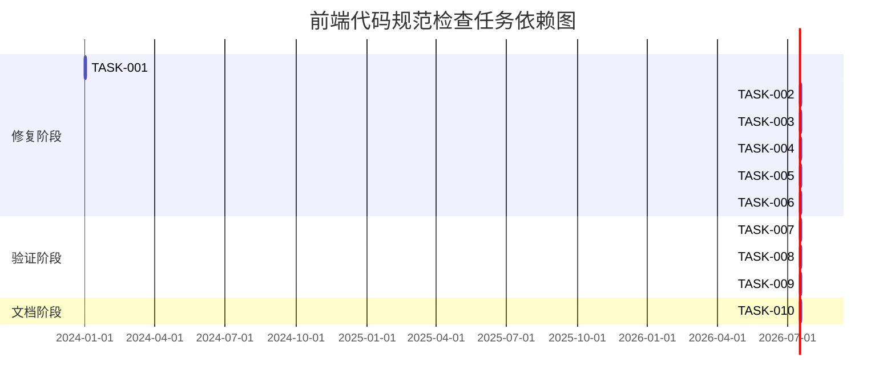

# 前端代码规范检查 - 任务分解

## 1. 子任务拆分

### 1.1 自动化工具修复任务

**任务ID**: TASK-001
**任务名称**: 运行Prettier自动格式化代码
**输入契约**: 
- 项目源代码文件
- `.prettierrc`配置文件
- 已安装的Prettier依赖
**输出契约**: 
- 格式化后的源代码文件
- 格式修复报告
**实现约束**: 
- 使用项目中配置的Prettier规则
- 通过`npm run format`命令执行
**依赖关系**: 无前置任务

### 1.2 自动化工具修复任务

**任务ID**: TASK-002
**任务名称**: 运行ESLint自动修复代码
**输入契约**: 
- 项目源代码文件
- `.eslintrc.js`配置文件
- 已安装的ESLint依赖
**输出契约**: 
- 修复后的源代码文件
- ESLint修复报告
**实现约束**: 
- 使用项目中配置的ESLint规则
- 通过`npm run lint:fix`命令执行
**依赖关系**: 前置任务：TASK-001

### 1.3 手动修复任务

**任务ID**: TASK-003
**任务名称**: 修复InspirationView.vue中未使用的变量和函数
**输入契约**: 
- `src/views/InspirationView.vue`文件
- ESLint警告信息
**输出契约**: 
- 清理后的`InspirationView.vue`文件
- 修复记录
**实现约束**: 
- 删除或注释未使用的变量和函数
- 保持代码功能逻辑不变
**依赖关系**: 前置任务：TASK-002

### 1.4 手动修复任务

**任务ID**: TASK-004
**任务名称**: 修复WardrobeView.vue中未使用的变量
**输入契约**: 
- `src/views/WardrobeView.vue`文件
- ESLint警告信息
**输出契约**: 
- 清理后的`WardrobeView.vue`文件
- 修复记录
**实现约束**: 
- 删除或注释未使用的变量
- 保持代码功能逻辑不变
**依赖关系**: 前置任务：TASK-002

### 1.5 手动修复任务

**任务ID**: TASK-005
**任务名称**: 修复weatherStore.js中未使用的变量
**输入契约**: 
- `src/stores/modules/weatherStore.js`文件
- ESLint警告信息
**输出契约**: 
- 清理后的`weatherStore.js`文件
- 修复记录
**实现约束**: 
- 删除或注释未使用的变量
- 保持代码功能逻辑不变
**依赖关系**: 前置任务：TASK-002

### 1.6 手动修复任务

**任务ID**: TASK-006
**任务名称**: 修复outfitCreatorService.js中未使用的导入
**输入契约**: 
- `src/services/outfitCreatorService.js`文件
- ESLint警告信息
**输出契约**: 
- 清理后的`outfitCreatorService.js`文件
- 修复记录
**实现约束**: 
- 删除未使用的导入
- 保持代码功能逻辑不变
**依赖关系**: 前置任务：TASK-002

### 1.7 验证任务

**任务ID**: TASK-007
**任务名称**: 运行ESLint验证修复结果
**输入契约**: 
- 修复后的源代码文件
**输出契约**: 
- ESLint验证报告
- 通过/失败状态
**实现约束**: 
- 使用`npm run lint`命令执行
- 要求无错误和警告
**依赖关系**: 前置任务：TASK-003, TASK-004, TASK-005, TASK-006

### 1.8 验证任务

**任务ID**: TASK-008
**任务名称**: 运行Prettier验证修复结果
**输入契约**: 
- 修复后的源代码文件
**输出契约**: 
- Prettier验证报告
- 通过/失败状态
**实现约束**: 
- 使用`npm run format:check`命令执行
- 要求无格式问题
**依赖关系**: 前置任务：TASK-007

### 1.9 验证任务

**任务ID**: TASK-009
**任务名称**: 构建项目验证修复结果
**输入契约**: 
- 修复后的源代码文件
**输出契约**: 
- 构建结果报告
- 通过/失败状态
**实现约束**: 
- 使用`npm run build`命令执行
- 要求构建成功
**依赖关系**: 前置任务：TASK-008

### 1.10 文档任务

**任务ID**: TASK-010
**任务名称**: 生成代码规范检查和修复报告
**输入契约**: 
- 检查结果
- 修复记录
- 验证报告
**输出契约**: 
- ACCEPTANCE文档
- FINAL总结文档
- TODO改进建议文档
**实现约束**: 
- 文档格式符合项目规范
- 详细记录问题和修复情况
**依赖关系**: 前置任务：TASK-009

## 2. 任务依赖图

## 3. 拆分原则

- **复杂度可控**：每个任务的复杂度适中，便于执行和验证
- **功能独立**：每个任务具有明确的目标和范围，可独立验证
- **依赖清晰**：任务之间的依赖关系明确，避免循环依赖
- **逐步验证**：每个修复步骤后都有验证环节，确保修复有效

---
任务分解日期：2024年
分解人：系统管理员