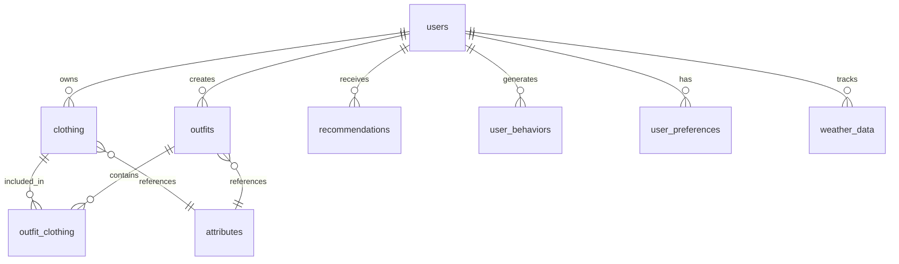

# StyleVault 项目现状报告

## 1. 项目概述

StyleVault 是一个智能衣橱管理系统，采用前后端分离架构，提供衣物管理、搭配推荐、天气适配等功能。

### 核心功能
- 用户认证与授权
- 衣物管理（上传、分类、编辑）
- 智能搭配推荐
- 天气数据集成
- 用户行为分析
- 衣物收藏与管理

## 2. 技术栈

### 前端技术栈
| 技术 | 版本 | 用途 |
|------|------|------|
| Vue | 3.5.19 | 前端框架 |
| TypeScript | - | 类型支持 |
| Vite | 5.0.10 | 构建工具 |
| Vue Router | 4.5.1 | 路由管理 |
| Pinia | 3.0.3 | 状态管理 |
| TailwindCSS | 3.4.3 | CSS框架 |
| Axios | 1.11.0 | HTTP客户端 |
| Font Awesome | 6.7.2 | 图标库 |
| Vitest | 1.6.0 | 测试框架 |

### 后端技术栈
| 技术 | 版本 | 用途 |
|------|------|------|
| Node.js | ≥18.0.0 | 运行时环境 |
| TypeScript | 5.3.3 | 类型系统 |
| Express | 4.18.2 | Web框架 |
| Sequelize | 6.37.7 | ORM框架 |
| MySQL | ≥8.0.0 | 数据库 |
| Redis | 4.6.13 | 缓存 |
| JWT | 9.0.2 | 身份认证 |
| Jest | 29.7.0 | 测试框架 |

## 3. 项目结构

### 目录结构
```
stylevault-vue-project/
├── backend/            # 后端代码
│   ├── src/            # 主源码
│   ├── tests/          # 测试文件
│   ├── docs/           # 后端文档
│   └── scripts/        # 脚本文件
├── front/              # 前端代码
│   ├── src/            # 主源码
│   ├── public/         # 静态资源
│   └── docs/           # 前端文档
└── docs/               # 项目级文档
```

### 前端核心目录
```
front/src/
├── adapters/           # 数据适配器
├── assets/             # 静态资源
├── components/         # Vue组件
├── constants/          # 常量定义
├── router/             # 路由配置
├── services/           # 服务层
├── stores/             # Pinia状态管理
├── types/              # TypeScript类型定义
├── utils/              # 工具函数
└── views/              # 页面组件
```

### 后端核心目录
```
backend/src/
├── config/             # 配置文件
├── controllers/        # 控制器层
├── middleware/         # 中间件
├── models/             # 数据模型
├── repositories/       # 数据访问层
├── routes/             # 路由定义
├── services/           # 业务逻辑层
├── types/              # 类型定义
└── utils/              # 工具函数
```

## 4. 功能模块划分

### 前端功能模块
| 模块 | 主要功能 | 对应页面 |
|------|----------|----------|
| 认证模块 | 用户登录、注册 | LoginPage.vue |
| 衣橱管理 | 衣物列表、分类、搜索 | WardrobeView.vue |
| 天气适配 | 基于天气的搭配推荐 | WeatherView.vue |
| 搭配创作 | 自定义搭配创作 | InspirationView.vue |
| 数据分析 | 用户行为分析 | AnalysisView.vue |
| 衣物上传 | 衣物图片上传、信息录入 | UploadView.vue |

### 后端功能模块
| 模块 | 主要功能 | 对应控制器 |
|------|----------|------------|
| 认证模块 | 用户登录、注册、JWT生成 | AuthController.ts |
| 衣物管理 | 衣物CRUD操作 | ClothingController.ts |
| 搭配管理 | 搭配方案CRUD | OutfitController.ts |
| 用户偏好 | 用户偏好设置管理 | UserPreferencesController.ts |
| 健康检查 | 系统健康状态监控 | HealthController.ts |

## 5. 代码架构

### 前端架构
- **组件化设计**：采用原子化组件设计，分为UI组件、布局组件和业务组件
- **状态管理**：使用Pinia进行集中状态管理，按功能模块划分store
- **服务层设计**：封装API请求和业务逻辑，提供统一的数据访问接口
- **适配器模式**：使用适配器转换后端数据格式，适配前端需求

### 后端架构
- **分层架构**：控制器层 → 服务层 → 仓库层 → 模型层
- **中间件机制**：实现认证、验证、日志等横切关注点
- **依赖注入**：使用TypeScript反射元数据实现依赖注入
- **统一错误处理**：全局异常处理机制，标准化错误响应格式

## 6. 数据模型

### 核心数据模型
- **用户表(users)**：存储用户基本信息和偏好
- **衣物表(clothing)**：存储衣物信息，采用属性标准化设计
- **搭配表(outfits)**：存储用户衣物搭配方案
- **搭配衣物关联表(outfit_clothing)**：建立搭配与衣物的多对多关系
- **属性表(attributes)**：标准化管理系统所有枚举属性值
- **智能推荐表(recommendations)**：存储个性化推荐结果
- **用户行为表(user_behaviors)**：记录用户行为数据
- **天气数据表(weather_data)**：存储天气信息用于智能推荐

### 数据关系图


## 7. 开发规范

### 前端开发规范
- **代码风格**：ESLint + Prettier 集成
- **组件命名**：使用 PascalCase 命名组件文件
- **状态管理**：按功能模块划分 Pinia store
- **API请求**：统一封装在 services 目录下
- **测试框架**：使用 Vitest 进行单元测试和集成测试

### 后端开发规范
- **代码风格**：ESLint + Prettier 集成
- **命名规范**：控制器、服务、模型使用 PascalCase
- **API设计**：RESTful API 设计，统一响应格式
- **数据库设计**：使用 Sequelize ORM，软删除支持
- **测试框架**：使用 Jest 进行单元测试和集成测试

## 8. 测试策略

### 前端测试
- **测试框架**：Vitest + JSDOM
- **测试类型**：单元测试、组件测试
- **覆盖率报告**：支持 text、json、html 格式
- **测试文件命名**：`*.test.js` 或 `*.spec.js`

### 后端测试
- **测试框架**：Jest
- **测试类型**：单元测试、集成测试
- **测试文件命名**：`*.test.ts`
- **数据库测试**：提供专门的数据库测试脚本

## 9. 部署流程

### 开发环境部署
```bash
# 前端
cd front
npm install --target_arch=arm64
npm run dev

# 后端
cd backend
npm install --target_arch=arm64
npm run dev
```

### 生产环境部署
- **前端构建**：`npm run build`，生成静态文件
- **后端构建**：`npm run build`，编译 TypeScript 代码
- **环境配置**：使用 `.env` 文件管理环境变量
- **服务启动**：使用 PM2 或其他进程管理工具

## 10. 已知问题和潜在风险

### 已知问题
- 前端常量文件中存在 WARNING 标记
- 后端数据库自动同步功能已禁用，需手动管理数据库迁移

### 潜在风险
- 前端使用 Vue CLI 和 Vite 混合配置，可能导致构建冲突
- 后端缺少完整的 API 文档（如 Swagger/OpenAPI）
- 测试覆盖率未达到项目规范要求
- 生产环境部署流程未完全自动化

## 11. 建议和改进方向

### 前端改进建议
- 统一构建工具，建议完全迁移到 Vite
- 完善测试用例，提高测试覆盖率
- 优化组件结构，减少组件嵌套层级
- 实现响应式设计，适配更多设备尺寸

### 后端改进建议
- 集成 Swagger/OpenAPI 生成 API 文档
- 实现数据库迁移机制，替代手动同步
- 完善错误日志记录，便于问题排查
- 优化数据库查询性能，添加必要索引

### 项目管理建议
- 制定更详细的开发流程和规范
- 建立定期代码审查机制
- 完善项目文档，包括架构设计、API文档等
- 实现 CI/CD 流水线，自动化测试和部署

## 12. 总结

StyleVault 项目采用了现代的前后端分离架构，技术栈选型合理，功能模块划分清晰。项目具有良好的扩展性和维护性，但在测试覆盖率、文档完整性、部署自动化等方面还有改进空间。

通过实施上述建议，可以进一步提高项目的质量和开发效率，为后续功能扩展和业务发展奠定坚实基础。